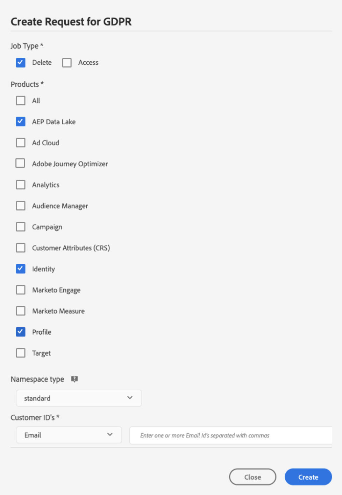

# Privacy requests {#track-changes}

<!--TO UPDATE WITH ANSWERS FROM DOCAC-12036-->

Once you created a composition, the resulting audiences are saved into Adobe Experience Platform. You can then make privacy requests to access and/or delete profile data corresponding to these audiences through Adobe Experience Platform **Privacy Service**, which provides a user interface and RESTful API to help you manage customer data requests.

With Privacy Service, you can submit requests to access and delete personal customer data from Adobe Experience Cloud applications, facilitating automated compliance with legal and organizational privacy regulations.

Privacy requests can be created and managed from the **[!UICONTROL Requests]** menu.

<!--replace with screenshot specific to FAC if any)-->

For more information on the Privacy Service and how to create and manage privacy requests, refer to the [Adobe Experience Platform documentation](https://experienceleague.adobe.com/docs/experience-platform/privacy/home.html){target="_blank"}.

<!--* [Managing privacy jobs in the Privacy Service UI](https://experienceleague.adobe.com/docs/experience-platform/privacy/ui/user-guide.html){target="_blank"}
* [Privacy Service API Guide](https://experienceleague.adobe.com/en/docs/experience-platform/privacy/api/overview){target="_blank"}-->

## Manage individual data privacy requests {#data-privacy-requests}

You can submit individual requests to access and delete consumer data from Adobe Federated Audience Composition in two ways:

* Through the **Privacy Service UI**. [Learn more](https://experienceleague.adobe.com/docs/experience-platform/privacy/ui/user-guide.html){target="_blank"}
* Through the **Privacy Service API**. [Learn more](https://experienceleague.adobe.com/en/docs/experience-platform/privacy/api/overview){target="_blank"}
<!--More information [here](https://developer.adobe.com/experience-platform-apis/references/privacy-service/#_blank) and API information [here](https://developer.adobe.com/experience-platform-apis/#_blank).-->

The Privacy Service supports two types of requests: **data access** and **data deletion**.

>[!NOTE]
>
>To make privacy requests for Adobe Journey Optimizer, refer to this [guide](https://experienceleague.adobe.com/en/docs/journey-optimizer/using/privacy/requests){target="_blank"}.

<!--If you also plan to make privacy requests for the Platform data lake, refer to this [guide](https://experienceleague.adobe.com/en/docs/experience-platform/catalog/privacy){target="_blank"} in addition to this tutorial. For Real time customer profile, please refer to this [guide](https://experienceleague.adobe.com/en/docs/experience-platform/profile/privacy){target="_blank"} and for Identity service, please refer to this [guide](https://experienceleague.adobe.com/en/docs/experience-platform/identity/privacy){target="_blank"}. For delete and access requests you need to call these individual systems to make sure the requests are handled by each of them. Making a privacy request to Adobe Journey Optimizer will not remove data from all these systems.-->

For **access requests** and **delete requests**, specify the three following services from the UI:

* Profile (product code: "profileService" in the API)
* AEP Data Lake (product code: "AdobeCloudPlatform" in the API)
* Identity (product code: "identity" in the API)

## Create Access and Delete requests

### Prerequisites

To make requests to Access and Delete data for Adobe Federated Audience Composition, you must have:

* an Adobe organization ID
* an Identity identifier of the person you want to act on and the corresponding namespace(s). For more information about identity namespaces Experience Platform, see the [identity namespace overview](https://experienceleague.adobe.com/en/docs/experience-platform/identity/features/namespaces).

### Required field values for API requests

```json
"companyContexts":
    "namespace": imsOrgID
    "value": <Your Adobe Organization ID Value>

"users":
    "action": either access or delete

    "userIDs":
        "namespace": e.g. email, aaid, ecid, etc.
        "type": standard
        "value": <Data Subject's Identity Identifier>

"include":
    profileService (product code for Profile)
    AdobeCloudPlatform (product code for AEP Data Lake)
    identity (product code for Identity)

"regulation":
    gdpr, ccpa, pdpa, lgpd_bra, or nzpa_nzl (which is the privacy regulation that applies to the request)
```


### GDPR Access request example

From the UI:

{width="60%" align="center"}
<!--replace with screenshot specific to FAC if any)-->

Through the API:

```json
// JSON Request
{
   "companyContexts":[
      {
         "namespace":"imsOrgID",
         "value":"745F37C35E4B776E0A49421B@AdobeOrg"
      }
   ],
   "users":[
      {
         "action":[
            "access"
         ],
         "userIDs":[
            {
               "namespace":"ecid",
               "value":"38400000-8cf0-11bd-b23e-10b96e40000d",
               "type":"standard"
            },
            {
               "namespace":"email",
               "value":"johndoe4@gmail.com",
               "type":"standard"
            }
         ]
      }
   ],
   "include":[
    "profileService", "AdobeCloudPlatform", "identity"
   ],
   "regulation":"gdpr"
}
```

```json
// JSON Response
{
    "requestId": "17163122360480365RX-705",
    "totalRecords": 1,
    "jobs": [
        {
            "jobId": "e709b1f4-1796-11ef-b422-eddd0aebc40d",
            "customer": {
                "user": {
                    "key": "John Doe",
                    "action": [
                        "access"
                    ],
                    "userIDs": [
                        {
                            "namespace": "ecid",
                            "value": "38400000-8cf0-11bd-b23e-10b96e40000d",
                            "type": "standard",
                            "namespaceId": 4,
                            "isDeletedClientSide": false
                        },
                        {
                            "namespace": "email",
                            "value": "johndoe4@gmail.com",
                            "type": "standard",
                            "namespaceId": 6,
                            "isDeletedClientSide": false
                        }
                    ]
                }
            }
        }
    ]
}
```

### GDPR Delete request example

From the UI:

{width="60%" align="center"}
<!--replace with screenshot specific to FAC if any)-->

Through the API:

```json
// JSON Request
{
  "companyContexts": [
    {
      "namespace": "imsOrgID",
      "value": "745F37C35E4B776E0A49421B@AdobeOrg"
    }
  ],
  "users": [
    {
      "action": [
          "delete"
      ],
      "userIDs": [
        {
          "namespace": "ecid",
          "value": "38400000-8cf0-11bd-b23e-10b96e40000d",
          "type": "standard"
        },
                {
          "namespace": "email",
          "value": "johndoe4@gmail.com",
          "type": "standard"
        }
      ]
    }
  ],
  "include": [
    "profileService", "AdobeCloudPlatform", "identity"
  ],
  "regulation": "gdpr"
}
```

```json
// JSON Response
{
    "requestId": "17163122360480365RX-705",
    "totalRecords": 1,
    "jobs": [
        {
            "jobId": "e709b1f4-1796-11ef-b422-eddd0aebc40d",
            "customer": {
                "user": {
                    "key": "John Doe",
                    "action": [
                        "delete"
                    ],
                    "userIDs": [
                        {
                            "namespace": "ecid",
                            "value": "38400000-8cf0-11bd-b23e-10b96e40000d",
                            "type": "standard",
                            "namespaceId": 4,
                            "isDeletedClientSide": false
                        },
                        {
                            "namespace": "email",
                            "value": "johndoe4@gmail.com",
                            "type": "standard",
                            "namespaceId": 6,
                            "isDeletedClientSide": false
                        }
                    ]
                }
            }
        }
    ]
}
```
