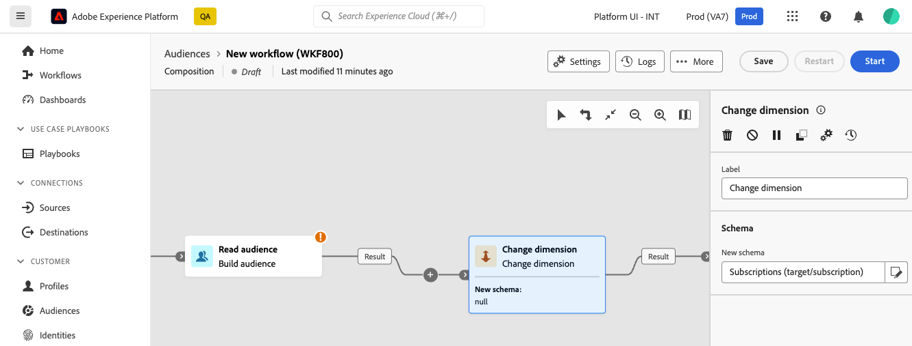

# Change dimension {#change-dimension}
 
>[!CONTEXTUALHELP]
>id="dc_orchestration_dimension_complement"
>title="Generate a complement"
>abstract="You can generate an additional outbound transition with the remaining population, which was excluded as a duplicate. To do this, toggle on the **Generate complement** option"

>[!CONTEXTUALHELP]
>id="dc_orchestration_change_dimension"
>title="Change dimension activity"
>abstract="This activity allows you to change the targeting dimension, i.e. the schema, as you are building an audience. It shifts the axis depending on the data template and the input dimension. For example, you can switch from the "contracts" dimension to the "clients" dimension."

The **Change dimension** activity allows you to change the targeting dimension, i.e. the schema, as you are building your audience. It shifts the axis depending on the data template and the input dimension. <!--[Learn more on targeting dimensions](../../audience/about-recipients.md#targeting-dimensions)-->

## Configure the Change dimension activity {#configure}

Follow these steps to configure the **Change dimension** activity:

1. Add a **Change dimension** activity to your composition.

    

1. Define the **New scheman**. During schema change, all records are kept. 

1. Execute the composition to view the result. Compare the data in the tables before and after the change dimension activity, and compare the structure of the composition tables.

<!--
## Example {#example}

In this example, we want to send an SMS delivery to all the profiles who have made a purchase. To do this, we first use a **[!UICONTROL Build audience]** activity linked to a custom "Purchase" targeting dimension to target all purchases that occurred.

We then use a **[!UICONTROL Change dimension]** activity to switch the workflow targeting dimension to "Recipients". This allows us to be able to target the recipients who match the query.
-->

<!-- on parle de dimension, mais dans UI "schema", va rester comme ça ?-->