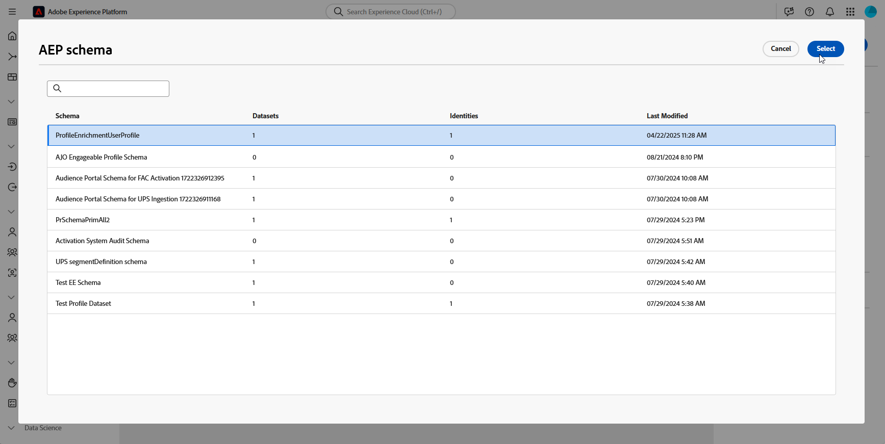

# Save profiles {#save-profile}

>[!CONTEXTUALHELP]
>id="dc_orchestration_saveprofile"
>title="Save Profiles"
>abstract="The Save Profiles activity allows you to enrich Experience Platform profiles by federating data from external warehouses, allowing you to enhance customer profiles with additional attributes. "

>[!CONTEXTUALHELP]
>id="dc_orchestration_saveprofile_aepschemalist"
>title="Select AEP Schema"
>abstract="Choose the Experience Platform schema for the profiles."

>[!CONTEXTUALHELP]
>id="dc_orchestration_saveprofile_primaryidentitynamespace"
>title="Select the Primary identify field"
>abstract="Select the Primary identity to use to identify the targeted profiles in the database."

>[!CONTEXTUALHELP]
>id="dc_orchestration_saveprofile_selectaepschema"
>title="Select AEP Schema"
>abstract="Choose the Experience Platform schema for the profiles."

The **Save profiles** activity allows you to enrich Adobe Experience Platform profiles with data federated from external warehouses.

This activity is typically used to enhance customer profiles by bringing in additional attributes and insights without physically moving or duplicating the data into the platform

## Configure the Save profiles activity {#save-profile-configuration}

Follow these steps to configure the **Save profiles** activity:

1. Add a **Save profiles** activity to your composition.

    

1. Specify the label of the profiles to create.

    >[!IMPORTANT]
    >
    >The audience label must be unique within the current sandbox. It cannot be the same label as any existing audience. 

1. Select the Adobe Experience Platform schema you want to use.

    

1. Choose the primary identity field that will be used to identify profiles in the database.

1. If you want to reconcile additional data attributes, click **Add attributes**.

    Then, specify the **Source** field (external data) and the **Destination** field (schema field) for each attribute you want to map.

    

1. Once configured, click **Start**.
