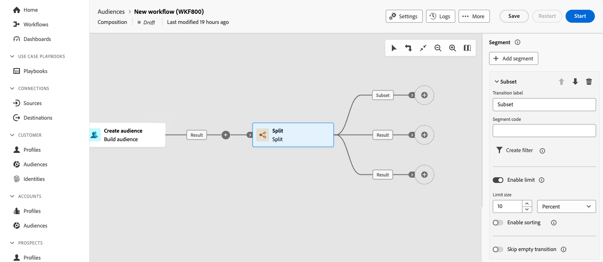

# Split {#split}

The **Split** activity allows you to segment incoming populations into multiple subsets based on different selection criteria, such as filtering rules or population size.

## Configure the Split activity {#split-configuration}
 

Follow these steps to configure the **Split** activity:

1. Add a **Split** activity to your composition.

1. The activity configuration pane opens with a default subset. Select the **Add segment** button to add as many subsets as desired to segment the incoming population.

    >[!IMPORTANT]
    >
    >When the **Split** activity is executed, the population is segmented across the different subsets in the order they are added to the activity. For example, if the first subset recovers 70% of the initial population, the next added subset will apply its selection criteria to the remaining 30% only, and so on.
    >
    >Before starting your composition, ensure that you have ordered the subsets in the order that suits your needs. To do this, use the arrow buttons to change the position of a subset.

1. Once subsets have been added, the activity shows as many output transitions as there are subsets. We strongly recommend changing the label of each subset to identify them easily in the composition canvas. 

    

1. Configure how each subset should filter the incoming population. To do this, follow these steps:

    1. Expand the subset to display its properties.

        

    1. To apply a filtering condition to the subset, select **[!UICONTROL Create filter]** and configure the desired filtering rule using the query modeler. For example, include profiles from the incoming population whose email address exist in the database. [Learn how to work with the query modeler](../../query/query-modeler-overview.md)

    1. To limit the number of profiles selected by the subset, toggle on the **[!UICONTROL Enable limit]** option, and specify the number or percentages of the population to include.

    1. To disable a transition if the incoming population is empty, toggle the **[!UICONTROL Skip empty transition]** option on. If no profile matches the subset, the composition will not transition to the next activity.
    
     >[!NOTE]
     >
     >When setting a population limit for a subset, you can rank the selected profiles based on a specific profile attribute, in ascending or descending order. To do this, toggle on the **[!UICONTROL Enable sorting]** option. For instance, you can restrict a subset to include only the top 50 profiles with the highest purchase amount.

1. Once that you have configured all the subsets, you can select the remaining population that did not match any of the subsets and include them into an additional outbound transition. To do this, toggle on the **[!UICONTROL Generate complement]** option.

1. The **[!UICONTROL Generate all subsets in the same table]** option allows you to group all the subsets into a single output transition.

1. The **[!UICONTROL Enable overlapping of output populations]** option lets you manage populations belonging to several subsets:

    * When the box isn't checked, the split activity makes sure a recipient cannot be present in several output transitions, even if it meets the criteria of several subsets. They will be in the target of the first tab with matching criteria.
    * When the box is checked, the recipients can be found in several subsets if they meet their filter criteria. Best practice is to use an exclusive criteria.

The activity is now configured. At execution, the population will be segmented into the different subsets, in the order they have been added to the activity.

<!--
## Example{#split-example}

In the following example, the **[!UICONTROL Split]** activity is used to segment an audience into distinct subsets based on the communication channel that we want to use :

* **Subset 1 "push"**: This subset comprises all profiles who have installed our mobile application.
* **Subset 2 "sms"**: Mobile phone users: For the remaining population that did not fall into Subset 1, subset 2 applies a filtering rule to select profiles with mobile phones in the database.
* **Complement transition**: This transition captures all the remaining profiles that did not match Subset 1 or Subset 2. Specifically, it includes profiles who neither installed the mobile application nor have a mobile phone, such as users who haven't installed the mobile app or lack a registered mobile number.

-->
