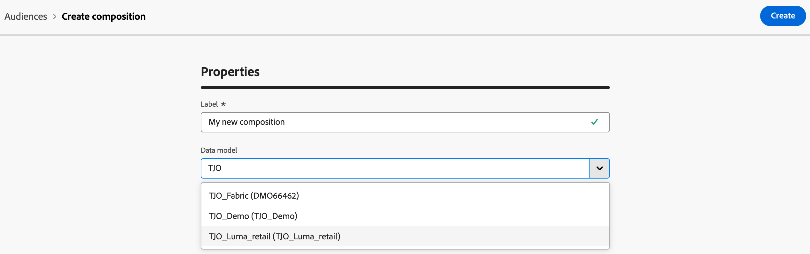

# Create a composition

>[!CONTEXTUALHELP]
>id="dc_composition_creation_properties"
>title="Composition properties"
>abstract="In this screen, choose the template to use to create the composition and specify a label. Expand the ADDITIONAL OPTIONS section to configure more settings such as the composition internal name, its folder, timezone, and supervisor group. It is highly recommended to select a supervisor group so that operators are alerted if an error occurs."

Federated Audience Composition lets you create compositions, where you can leverage various activities into a visual canvas to create audiences. After creating your composition, the resulting audiences are saved into Adobe Experience Platform and can be leveraged in Experience Platform destinations and Adobe Journey Optimizer to target customers. 

## Define your composition {#create}

To create a composition, you'll first need to define its label and optionally configure additional settings.

To create a composition, select **[!UICONTROL Audiences]** within the **[!UICONTROL Customer]** section, followed by the **[!UICONTROL Federated compositions]** tab.

The federated compositions browse page appears. Select **[!UICONTROL Create composition]** to continue with the composition creation process.

Within the **[!UICONTROL Properties]** section, specify a label for your composition and select a data model. Only the schemas associated to this data model will be available in your composition's activities.

Select **[!UICONTROL Create]**. The composition canvas is displayed. You can now configure your composition by adding activities and transitions to the canvas.

## Add activities {#add-activities}

* [Learn how to orchestrate activities](orchestrate-activities.md)
* [Learn how to start and monitor a composition](start-monitor-composition.md) 

## Configure the composition's settings {#settings}

>[!CONTEXTUALHELP]
>id="dc_composition_settings_properties"
>title="Composition properties"
>abstract="This section provides generic composition properties that are also accessible when creating the composition."

>[!CONTEXTUALHELP]
>id="dc_composition_settings_segmentation"
>title="Composition segmentation"
>abstract="By default, only the working tables of the last execution of the composition are kept. You can enable this option to keep working tables for testing purposes. It must be used **only** on development or staging environments. It must never be checked in a production environment."

>[!CONTEXTUALHELP]
>id="dc_composition_settings_error"
>title="Error management settings"
>abstract="In this section, you can define how to manage errors during the execution. You can choose to pause the process, ignore a certain number of errors, or stop the composition execution."

When accessing a composition, you can access advanced settings that allow you, for example, to define how the composition should behave in case of error. 

To access these additional options, select **[!UICONTROL Settings]** in the upper section of the composition creation screen.

Available settings are as follows: 

* **[!UICONTROL Label]**: Change the composition's label.

* **[!UICONTROL Keep the result of interim populations between two executions]**: By default, only the working tables of the last execution of the composition are kept. Working tables from previous executions are purged by a technical composition, which runs on a daily basis.

    If this option is enabled, working tables will be kept even after the composition has been executed. You can use it for testing purposes and hence must be used **only** on development or staging environments. It must never be checked in a production composition.

* **[!UICONTROL Error management]**: This option lets you define the actions to be taken if a composition activity has errors. There are three possible options:
    
    * **[!UICONTROL Suspend the process]**: The composition is automatically paused and its status changes to **[!UICONTROL Failed]**. Once the issue is solved, resume the composition using the **[!UICONTROL Resume]** buttons.
    * **[!UICONTROL Ignore]**: The status of the task that triggered the error changes to **[!UICONTROL Failed]**, but the composition keeps the **[!UICONTROL Started]** status.
    * **[!UICONTROL Abort the process]**: The composition is automatically stopped and its status changes to **[!UICONTROL Failed]**. Once the issue is solved, restart the composition using the **[!UICONTROL Start]** button.

* **[!UICONTROL Consecutive errors]**: Specify the number of errors that can be ignored before the process is stopped. Once this number is reached, the composition status changes to **[!UICONTROL Failed]**. If the value of this field is 0, the composition will never be stopped regardless of the number of errors.
