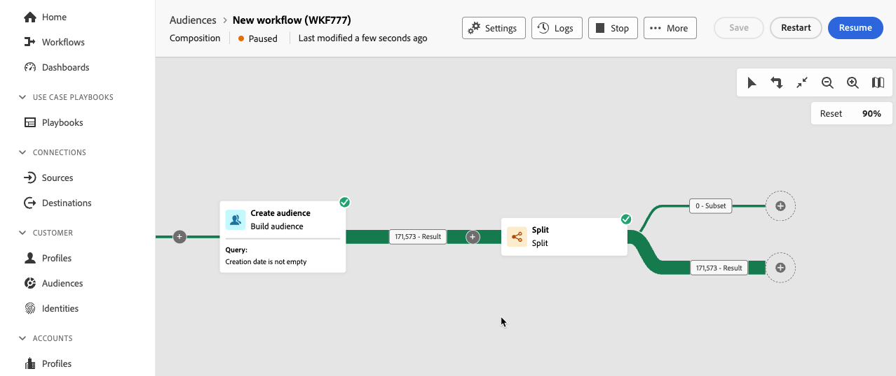
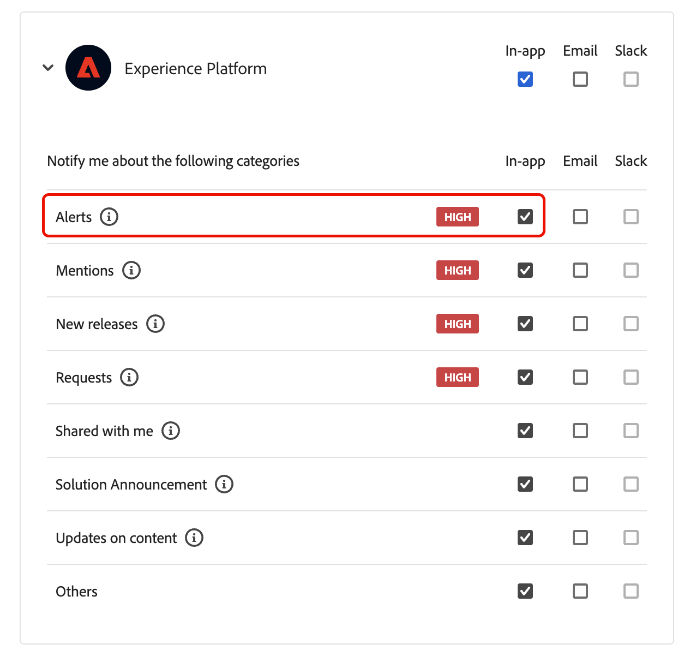

# Create a composition

Federated Audience Composition lets you create compositions, where you can leverage various activities into a visual canvas to create audiences. After creating your composition, the resulting audiences are saved into Adobe Experience Platform and can be leveraged in Experience Platform destinations and Adobe Journey Optimizer to target customers. 

## Define your composition {#create}

>[!CONTEXTUALHELP]
>id="dc_composition_creation_properties"
>title="Composition properties"
>abstract="In this screen, choose the template to use to create the composition and specify a label. Expand the ADDITIONAL OPTIONS section to configure more settings such as the composition internal name, its folder, timezone, and supervisor group. It is highly recommended to select a supervisor group so that operators are alerted if an error occurs."

To create a composition, you'll first need to define its label and optionally configure additional settings.

To create a composition, select **[!UICONTROL Audiences]** within the **[!UICONTROL Customer]** section, followed by the **[!UICONTROL Federated compositions]** tab.

The federated compositions browse page appears. Select **[!UICONTROL Create composition]** to continue with the composition creation process.

Within the **[!UICONTROL Properties]** section, specify a label for your composition and select a data model. Only the schemas associated to this data model will be available in your composition's activities.

Select **[!UICONTROL Create]**. The composition canvas is displayed. You can now configure your composition by adding activities and transitions to the canvas.

## Composition canvas {#canvas}

On the top of the canvas, you can access a toolbar that provides options to manage and navigate your activities.

Available options include:

* **[!UICONTROL Multiple selection]**: Select multiple activities to delete them all at once or copy and paste them. 
* **[!UICONTROL Rotate]**: Switch the canvas to display vertically.
* **[!UICONTROL Fit to screen]**: Adjust the canvas zoom level to your screen.
* **[!UICONTROL Zoom in]** / **[!UICONTROL Zoom out]**: Zoom in or out of the canvas.
* **[!UICONTROL Display map]**: Opens a snapshot of the canvas showing you are located.

## Add activities {#add-activities}

In the composition canvas, you can add activities and transitions that help define your audience. Activities let you *define* the components within the audience while transitions let you *organize* the flow of your composition.

For more information about the activities and transitions that are available for use, read the [activities overview](./activities.md). 

## Manage activities {#manage-activities}

You can perform operations on your added activities within the properties pane.

The options include: 

* **[!UICONTROL Delete]**: Delete the activity from the canvas.
* **[!UICONTROL Disable]/[!UICONTROL Enable]**: Disable or enable the activity. When the composition is executed, disabled activities and the following activities on the same path are not executed and the composition is stopped.
* **[!UICONTROL Pause]/[!UICONTROL Resume]**: Pause or resume the activity. When the composition is executed, it pauses at the paused activity. The corresponding task as well as all those that follow it in the same path are not executed.
* **[!UICONTROL Copy]**: Copies the activity to paste it at another location in the composition. To do this, select the **+** button on a transition and select **[!UICONTROL Paste X activity]**. <!-- cannot copy multiple activities ? cannot paste in another composition?-->
* Configure **[!UICONTROL Execution options]** for the selected activity. Available execution options include the following: 
    +++Available execution options

    The **[!UICONTROL Properties]** section allows you to configure generic settings regarding the execution of the activity:

    * **[!UICONTROL Execution]**: Define the action to be carried out when the is started.
    * **[!UICONTROL Maximum execution duration]**: Specify a duration such as "30s" or "1h". If the activity is not finished after the duration specified has been elapsed, an alert is triggered. This has no impact on how the composition functions.
    * **[!UICONTROL Time zone]**: Select the time zone of the activity. Federated Audience Composition allows you to manage the time differences between multiple countries on the same instance. The setting applied is configured when the instance is created.
    * **[!UICONTROL Affinity]**: Force the composition activity to execute on a particular machine. To do this, you must specify one or several affinities for the activity in question.
    * **[!UICONTROL Behavior]**: Define the procedure to follow if asynchronous tasks are used.

    The **[!UICONTROL Error management]** section allows you to specify the action to be carried out should the activity encounter an error.

    The **[!UICONTROL Initialization script]** section lets you initialize variables or modify activity properties. Select the **[!UICONTROL Edit code]** button and type the snippet of code to execute. The script is called when the activity executes.

    +++
* **Logs and tasks**: View the logs and tasks for the selected activity.
  
## Start and monitor your composition {#start-and-monitor}

After you've finished adding your activities to the composition, you can start the composition's execution. To start a composition, select the **[!UICONTROL Start]** button in the upper-right corner of the screen. 

| Action | Description |
| ------ | ----------- |
| **Start** | Begins the composition's execution and moves it to the **In progress** status. |
| **Pause** | Pauses the execution of the composition and sets it to the **Paused** status. No new activities will be activated until the composition is resumed, but operations that are in progress are **not** suspended. |
| **Resume** | Resumes the execution of the paused composition and sets it to the **In progress** status. |
| **Stop** | Stops the composition's execution and sets it to the **Finished** state. You **cannot** resume the composition from the same place from where it's stopped. |
| **Restart** | Stops and re-starts the composition's execution. |

When the composition is running, each activity in the canvas is executed in a sequential order, until the end of the composition is reached. You can track the progress of targeted profiles in real-time using a visual flow. This allows you to quickly identify the status of each activity and the number of profiles transitioning between them.

The visual indicators on the top-right corner of each activity shows the status of the execution:

| Visual indicator | Description |
| ---------------- | ------------|
|{zoomable="yes"}{width="70%"}| The activity is currently being executed. |
|{zoomable="yes"}{width="70%"}| The activity requires your attention. This may involve confirming the sending of a delivery or taking a necessary action. |
|{zoomable="yes"}{width="70%"}|The activity has encountered an error. To resolve the issue, open the composition logs for more information.|
|{zoomable="yes"}{width="70%"}|The activity has been successfully executed. |

### Monitor logs and tasks {#monitor-logs}

Additionally, you can view the composition logs to ensure they are running properly. Select **[!UICONTROL Logs]** within the action tool bar to see this information.

The **[!UICONTROL Composition logs and tasks]** screen appears. This provides a history of the composition execution, recording all user actions and encountered errors.

The history is organized into several tabs, detailed below:

* The **[!UICONTROL Log]** tab contains the execution history of all the composition activities. It indexes the operations carried out and execution errors by chronological order.
* The **[!UICONTROL Tasks]** tab details the execution sequencing of the activities. The button located at the end of each task allows you to list the event variables passed through the activity.
* The **[!UICONTROL Variables]** tab lists all variables passed in the composition. It is available when accessing the logs and tasks from the composition canvas only. It is now available when accessing the logs from an activity's properties pane. 

In all tabs, you can choose the displayed columns and their order, apply filters, and use the search field to quickly find the desired information.

### Subscribe to alerts {#alerts}

You can also subscribe to alerts to receive notifications if your federated composition executions have succeeded or failed.

To subscribe to alerts, select the , followed by the .

{zoomable="yes"}{width="70%"}

The notifications settings page is displayed. On this page, select **[!UICONTROL Experience Platform]** and choose the channels of alerts you want. To see the notifications within the UI, select **[!UICONTROL In-app]**.

{zoomable="yes"}{width="50%"}

With **[!UICONTROL In-app]** selected, you'll now be notified for composition execution successes and failures.

{zoomable="yes"}{width="70%"}

## Configure the composition's settings {#settings}

>[!CONTEXTUALHELP]
>id="dc_composition_settings_properties"
>title="Composition properties"
>abstract="This section provides generic composition properties that are also accessible when creating the composition."

>[!CONTEXTUALHELP]
>id="dc_composition_settings_segmentation"
>title="Composition segmentation"
>abstract="By default, only the working tables of the last execution of the composition are kept. You can enable this option to keep working tables for testing purposes. It must be used **only** on development or staging environments. It must never be checked in a production environment."

>[!CONTEXTUALHELP]
>id="dc_composition_settings_error"
>title="Error management settings"
>abstract="In this section, you can define how to manage errors during the execution. You can choose to pause the process, ignore a certain number of errors, or stop the composition execution."

When accessing a composition, you can access advanced settings that allow you, for example, to define how the composition should behave in case of error. 

To access these additional options, select **[!UICONTROL Settings]** in the upper section of the composition creation screen.

| Settings | Description |
| -------- | ----------- |
| **[!UICONTROL Label]** | Update the name given to the composition. |
| **[!UICONTROL Keep the result of interim populations between two executions]** | If this option is enabled, working tables will be kept even after the composition has been executed. By default, only the working tables of the last execution of the composition are kept. Working tables from previous executions are removed on a daily basis. You should only enable this setting on a development or staging environment. You should **never** enable this setting on a production environment. |
| **[!UICONTROL Error management]** | Defines the actions taken if the composition has an error. There are three possible options: <ul><li>**[!UICONTROL Suspend the process]**: The composition is automatically paused and its status changes to **[!UICONTROL Failed]**. Once the issue is solved, resume the composition using the **[!UICONTROL Resume]** buttons.</li><li>**[!UICONTROL Ignore]**: The status of the task that triggered the error changes to **[!UICONTROL Failed]**, but the composition keeps the **[!UICONTROL Started]** status.</li><li>**[!UICONTROL Abort the process]**: The composition is automatically stopped and its status changes to **[!UICONTROL Failed]**. Once the issue is solved, restart the composition using the **[!UICONTROL Start]** button.</li></ul> |
| **[!UICONTROL Consecutive errors]** | Specify the number of errors that can be ignored before the process is stopped. Once this number is reached, the composition status changes to **[!UICONTROL Failed]**. If the value of this field is 0, the composition will never be stopped regardless of the number of errors. |
