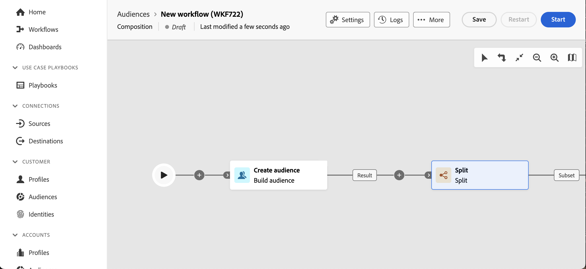
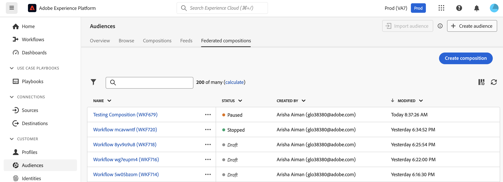
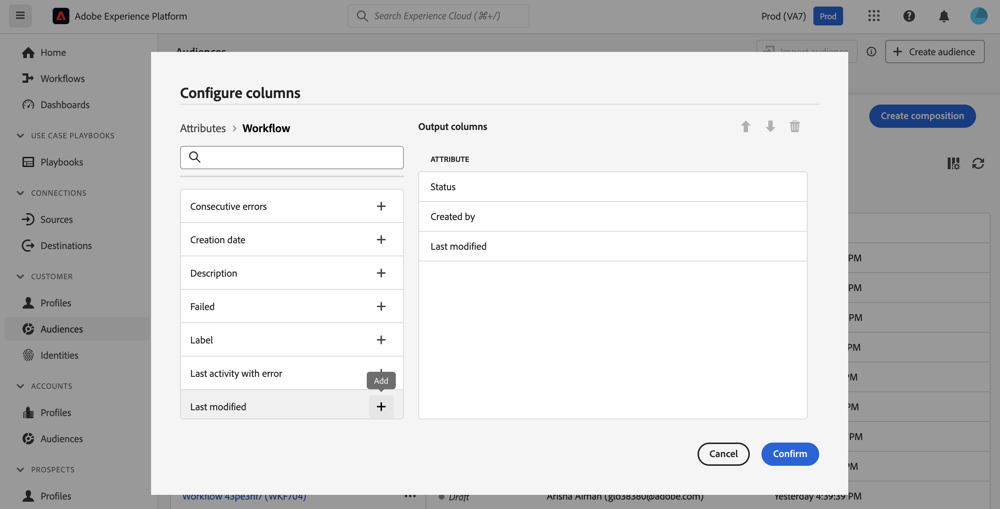

# Get started with compositions {#compositions}

>[!AVAILABILITY]
>
>To access compositions, you'll need one of the following permissions:
>
>-**Manage Federated Compositions**
>-**View Federated Compositions**
>
>For more information on the required permissions, please read the [access control guide](/help/governance-privacy-security/access-control.md).

Federated Audience Composition lets you create compositions, where you can leverage various activities into a visual canvas to create audiences. After creating your composition, the resulting audiences are saved into Adobe Experience Platform and can be leveraged in Experience Platform destinations and Adobe Journey Optimizer to target customers. 

{zoomable="yes"}{width="70%"}

## Access and manage compositions {#access}

>[!CONTEXTUALHELP]
>id="dc_composition_list"
>title="Compositions"
>abstract="In this screen, you can access the full list of compositions, check their current status, last/next execution dates, and create a new composition."

Compositions are accessible from the Adobe Experience Platform **[!UICONTROL Audiences]** menu, in the **[!UICONTROL Federated compositions]** tab within the **[!UICONTROL Customers]** section.

From this screen, you can create new compositions and access existing ones. You can also duplicate or delete an existing composition by selecting the  button next to its name.

You can also view information about the compositions, including the name, status, creator, and last modified date.

| Status | Description |
| ------ | ----------- |
| **[!UICONTROL Draft]** | The composition has been created and saved. |
| **[!UICONTROL In progress]** | The composition has been executed and is currently running. |
| **[!UICONTROL Stopped]** | The composition execution is complete and has stopped. |
| **[!UICONTROL Paused]** | The composition execution has been paused. |
| **[!UICONTROL Erroneous]** | The composition execution has encountered an error. To view more information about the error, open the composition and access the logs. |

You can learn how to start or stop a composition in the [start and monitor composition guide](./start-monitor-composition.md).

{zoomable="yes"}{width="70%"}

To refine the list and find the composition you are looking for, you can search the list, and filter compositions by their statuses or last processing dates.

You can also customize the list by adding or removing columns. To do this, select the **[!UICONTROL Configure columns]** button and add or remove the desired output columns.

{zoomable="yes"}{width="70%"}

### Apply access labels {#access-labels}

To apply access labels to a specific composition, select the composition, followed by **[!UICONTROL Manage access]**.

{zoomable="yes"}{width="70%"}

The **[!UICONTROL Manage access]** popover appears. On this page, you can apply the applicable access and data governance labels to your composition.

{zoomable="yes"}{width="70%"}

| Label type | Description |
| ---------- | ----------- |
| Contract labels | Contract labels ("C" labels) are used to categorize data that has contractual obligations or is related to your organization's data governance policies. |
| Identity labels | Identity labels ("I" labels) are used to categorize data that can identify or contact a specific person. |
| Sensitive labels | Sensitive labels ("S" labels) are used to categorize you and/or your organization consider sensitive. |
| Partner Ecosystem labels | Partner Ecosystem labels are used to categorize data from sources external to your organization. |

For more information about access and data governance labels, please read the [data usage label glossary](https://experienceleague.adobe.com/en/docs/experience-platform/data-governance/labels/reference).

## Next steps

After reading this guide, you've learned how to access, manage, and create access labels for your compositions. For more information on working with audiences as a whole, please read the [audiences guide](../start/audiences.md).
