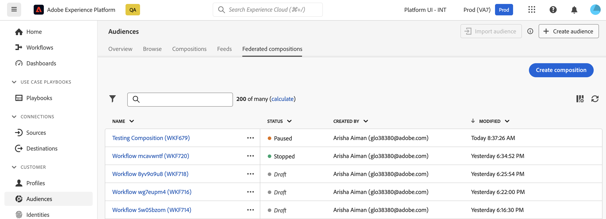

# Get started with compositions {#compositions}

## What is a composition ? {#what}

Adobe Data Composition allows you to create compositions, where you can leverage various activities (split, exclude…) into a visual canvas to create audiences. Once done, the resulting audiences are saved into Adobe Experience Platform along with existing audiences and can be leveraged in destinations such as Journey Optimizer to target customers.

## Access & manage compositions {#access}

>[!CONTEXTUALHELP]
>id="dc_composition_list"
>title="Compositions"
>abstract="In this screen, you can access the full list of compositions, check their current status, last/next execution dates, and create a new composition."

Compositions are accessible from the Adobe Experience Platform **[!UICONTROL Audiences]** menu, in the **[!UICONTROL Federated compositions]** tab.

From this screen, you can create new compositions and access existing ones. You can also duplicate or delete an existing composition by clicking the ellipsis button next to its name.

To refine the list and easily find the composition you are looking for, you can search the list, and filter compositions by their statuses or last processing dates.

You can also customize the list by adding or removing columns. To do this, click the **[!UICONTROL Configure column]**s button and add or remove the desired output columns.

## Compositions' statuses {#status}

Compositions can have multiple statuses:

* **[!UICONTROL Draft]**: The composition has been created and saved.
* **[!UICONTROL In progress]**: The composition has been executed and is currently running.
* **[!UICONTROL Stopped]**: The composition execution has stopped.
* **[!UICONTROL Paused]**: The composition execution has been paused.
* **[!UICONTROL Erroneous]**: The composition execution has encountered an error. Open the composition and access the logs and tasks to identify the error and resolve it.

Detailed information on how to start and monitor a composition is available in [this section](../compositions/start-monitor-composition.md).