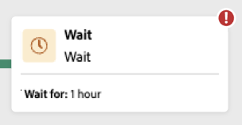

# Start and monitor your composition {#start-monitor}

Once that you have created your composition and designed the tasks to perform in the canvas, you can launch it and monitor how it is being executed. 

## Start the composition {#start}

To start a composition, click the **[!UICONTROL Start]** button in the upper-right corner of the screen. When the composition is running, each activity in the canvas is executed in a sequential order, until the end of the composition is reached.

You can track the progress of targeted profiles in real-time using a visual flow. This allows you to quickly identify the status of each activity and the number of profiles transitioning between them.

## Composition transitions {#transitions}

In compositions, data transported from one activity to another through transitions is stored in a temporary work table. This data can be displayed for each transition. To do this, select a transition to open its properties in the right hand side of the screen.

* Click **[!UICONTROL Preview schema]** to display the schema of the work table.
* Click **[!UICONTROL Preview results]** to visualize the data transported in the selected transition.

## Monitor activity execution {#activities}

Visual indicators in the upper-right corner of each activity box allows you to check their execution:

|Visual indicator | Description | 
|-----|------------|
|{zoomable="yes"}{width="70%"}| The activity is currently being executed. |
|{zoomable="yes"}{width="70%"}| The activity requires your attention. This may involve confirming the sending of a delivery or taking a necessary action. |
|{zoomable="yes"}{width="70%"}|The activity has encountered an error. To resolve the issue, open the composition logs for more information.|
|{zoomable="yes"}{width="70%"}|The activity has been succesfully executed. | 

## Monitor logs and tasks {#logs-tasks}

Monitoring compositions logs and tasks is a key step to analyze your compositions and make sure they are running properly. They are accessible from the **[!UICONTROL Logs]** button which is available in the action tool bar and in each activity's properties pane.

The **[!UICONTROL Composition logs and tasks]** screen provides an history of the composition execution, recording all user actions and encountered errors.

<!-- à confirmer, pas trouvé dans les options = The workflow history is saved for the duration specified in the workflow execution options. During this duration, all the messages are therefore saved, even after a restart. If you do not want to save the messages from a previous execution, you have to purge the history by clicking the  button.-->

The history is organized into several tabs, detailed below:

* The **[!UICONTROL Log]** tab contains the execution history of all the composition activities. It indexes the operations carried out and execution errors by chronological order.
* The **[!UICONTROL Tasks]** tab details the execution sequencing of the activities. The button located at the end of each task allows you to list the event variables passed through the activity.
* The **[!UICONTROL Variables]** tab lists all variables passed in the composition. It is available when accessing the logs and tasks from the composition canvas only. It is now available when accessing the logs from an activity's properties pane.  <!-- à confirmer-->

In all tabs, you can choose the displayed columns and their order, apply filters, and use the search field to quickly find the desired information.

## Composition execution commands {#execution-commands}

The action bar in the upper-right corner provides commands that allow you to manage the composition execution.

Available actions are:

* **[!UICONTROL Start]**: Starts the execution of the composition, which then takes on the **[!UICONTROL In progress]** status. The composition is started and the initial activities are activated.

* **[!UICONTROL Resume]**: Resumes the execution of the  composition that had been paused. The composition takes on the **[!UICONTROL In progress]** status.

* **[!UICONTROL Pause]** the execution of the composition, which then takes on the **[!UICONTROL Paused]** status. No new activities will be activated until it is resumed, but operations in progress are not suspended.

* **[!UICONTROL Stop]** a composition that is being executed, which will then take on the **[!UICONTROL Finished]** status. The operations in progress are interrupted if possible. You cannot resume from the composition from the same place that it was stopped.

* **[!UICONTROL Restart]**: Stops then restart a composition. In most cases, this allows you to restart quicker, as stopping takes a certain amount of time, and the **[!UICONTROL Start]** button is only available when the stop is effective.
