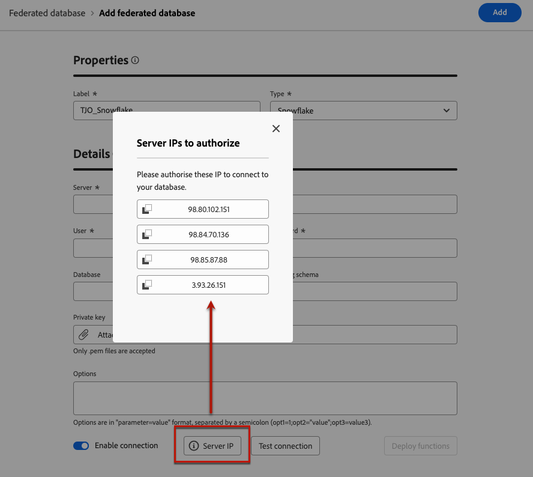

# Create connections {#connections-fdb}

>[!AVAILABILITY]
>
>To access connections, you'll need one of the following permissions:
>
>-**Manage Federated Database**
>-**View Federated Database**
>
>For more information on the required permissions, please read the [Access Federated Audience Composition guide](/help/start/feature-access.md).

Experience Platform Federated Audience Composition allows Customer to build and enrich audiences from the third-party data warehouses and import the audiences to Adobe Experience Platform. Supported datawarehouses are listed in [this section](../start/access-prerequisites.md#supported-systems).

To work with your federated database and Adobe Experience Platform, you must first establish a connection. This connection is set up in a dedicated user interface available in the Adobe Experience Platform user interface, as detailed on this page.

To setup a connection with your database, follow these steps:

1. Browse to **[!UICONTROL FEDERATED DATA]** section on the left rail.

1. In the **[!UICONTROL Federated databases]** link, click on **[!UICONTROL Add federated database]** button.

    {zoomable="yes"}

1. Set the connection **[!UICONTROL Properties]**, with the name and the type of your database. 

    {zoomable="yes"}

    Selecting its type gives you access to other properties to fill in. Learn more here about the supported databases on [this page](federated-db.md).

    {zoomable="yes"}

    Configuration settings depend on the type of your database. Browse links below to access details you need to setup the connection: 

    * [Amazon Redshift](federated-db.md#amazon-redshift)
    * [Azure Synapse](federated-db.md#azure-synapse-redshift)
    * [Databricks](federated-db.md#databricks)
    * [Google BigQuery](federated-db.md#google-bigquery)
    * [Snowflake](federated-db.md#snowflake)
    * [Vertica Analytics](federated-db.md#vertica-analytics)
    * [Microsoft Fabric](federated-db.md#microsoft-fabric)

1. For each supported database, select the **[!UICONTROL Server IP]** button. The list of all IPs associated with your Federated Audience Composition instances display.

    {zoomable="yes"}

    Click an IP from the list to copy it into your system and authorize this IP to connect to your database.

    >[!NOTE]
    >
    >To use Federated Audience Composition for a given database, you must allow list all of the IP addresses associated with that database.

1. After fill in the details, click on **[!UICONTROL Test connection]** button, and on **[!UICONTROL Deploy functions]** button.

    {zoomable="yes"}

1. Finish the creation of your connection by clicking on the **[!UICONTROL Save]** button.

    An overview of your Federated database connection is available, as shown below: 

    {zoomable="yes"}
