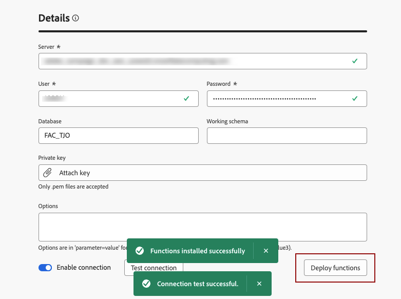

# Create connections {#connections-fdb}

Working with a Federated database directly in AEP implies to establish a connection with it.

To setup a connection with your database, go to **[!UICONTROL FEDERATED DATA]** section, and in the **[!UICONTROL Federated Databases]** link, click on **[!UICONTROL Add federated database]** button.

{zoomable="yes"}

You will access the window for the connection **[!UICONTROL Properties]**, with the name and the type of your database. 

{zoomable="yes"}

Selecting its type will give you access to other properties to fill in. [Learn more here about the supported databases](federated-db.md).

{zoomable="yes"}

According to the type of your database, learn in the links below the information you need to setup the connection : 
* [Amazon Redshift](federated-db.md#amazon-redshift)
* [Azure Synapse](federated-db.md#azure-synapse-redshift)
* [Google Big Query](federated-db.md#google-big-query)
* [Snowflake](federated-db.md#snowflake)
* [Vertica Analytics](federated-db.md#vertica-analytics)

After fill in the details, click on **[!UICONTROL Test connection]** button, and on **[!UICONTROL Deploy functions]** button.
Finish the creation of your connection by clicking on the **[!UICONTROL Save]** button.

{zoomable="yes"}

You will have an overview of your Federated dabase connection like this : 

{zoomable="yes"}