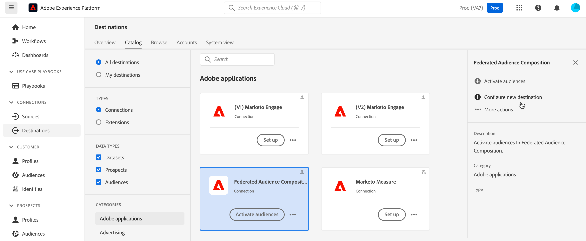
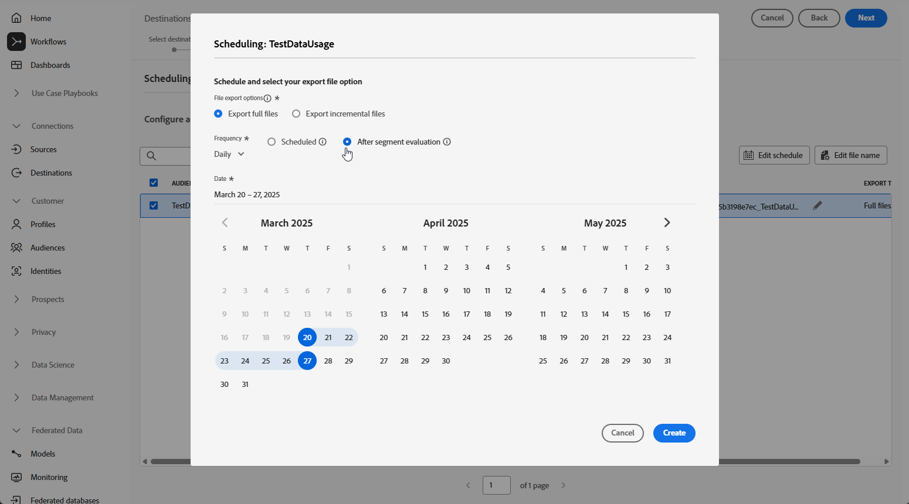

# Enrich Adobe Experience Platform audiences with external data {#connect-aep-fac}

>[!CONTEXTUALHELP]
>id="dc_new_destination"
>title="Create a destination"
>abstract="Enter the settings to connect to the new Federated database. Use the **[!UICONTROL Connect to destination]** button to validate your configuration."

Adobe Experience Platform allows seamless integration of audiences from the Audience Portal with your external databases using the **Adobe Federated Audience Composition destination**. With this integration, you can leverage existing audiences into compositions and enrich or refine them using data from your external databases to create new audiences.

To do so, you need to setup a new connection in Adobe Experience Platform to the Adobe Federated Audience Composition destination. You can use a scheduler to send a given audience at regular frequencies, select specific attributes to include, such as IDs for data reconciliation. If you have applied governance and privacy policies to your audience, they will be kept and sent back to the audience portal once the audience has been updated.

For instance, let's say you are storing purchase information in your data warehouse and have an Adobe Experience Platform audience targeting customers interested in a specific product within the last two months. Using the Federated Audience Composition destination, you can:

* Refine the audience based on purchase information. For example, you can filter the audience to target customers who have made a purchase of more than 150$ only.
* Enrich the audience with fields related to purchases such as the product name and the quantity purchased.

The main steps to send Adobe Experience Platform audiences to Adobe Federated Audience Composition are as follows:

1. Access the Adobe Experience Platform Destinations catalog and select the Federated Audience Composition destination.

    In the right pane, select **[!UICONTROL Configure new destination]**.

    

1. Enter a name for the new connection and select the **[!UICONTROL Connection Type]** from the following available connections:

    * Amazon Redshift
    * Azure Synapse Analytics
    * Google BigQuery
    * Snowflake
    * Vertica Analytics
    * Databricks
    * Microsoft Fabric

1. Select the **[!UICONTROL Federated database]** you want to connect to and click **[!UICONTROL Next]**.

    

1. In the **[!UICONTROL Alerts]** section, you can enable alerts to receive notifications on the status of the dataflow to your destination. 

    For more information on alerts, see the Adobe Experience Platform documentation about [subscribing to destinations alerts using the UI](https://experienceleague.adobe.com/en/docs/experience-platform/destinations/ui/alerts){target="_blank"}

1. The **[!UICONTROL Governance policy & enforcement actions]** step, you can define your data governance policies and ensure that the data used is compliant when audiences are sent and active.

    When you are finished selecting the desired marketing actions for the destination, click **[!UICONTROL Create]**.

1. The new connection to the destination is created. You can now activate audiences to send over to the destination. To do so, select it from the list and click **[!UICONTROL Next]**

    

1. Select the desired audiences that you want to send.

1. Select the  icon to edit your export schedule.

    

1. Define your export file options. To activate the audiences faster, select the **[!UICONTROL After segment evaluation]** option to trigger the activation job immediately after the daily Platform batch segmentation job finishes.

    

    >[!NOTE]
    >
    >Detailed information on how to configure schedule and filenames is available in the followins sections of Adobe Experience Platform documentation:
    >
    >* [Schedule audience export](https://experienceleague.adobe.com/en/docs/experience-platform/destinations/ui/activate/activate-batch-profile-destinations#scheduling){target="_blank"} 
    >* [Configure file names](https://experienceleague.adobe.com/en/docs/experience-platform/destinations/ui/activate/activate-batch-profile-destinations#configure-file-names){target="_blank"} 

1. In the **[!UICONTROL Mapping]** step, select which attribute and identity fields to export for your audience(s). For more information, view the [mapping step](https://experienceleague.adobe.com/en/docs/experience-platform/destinations/ui/activate/activate-batch-profile-destinations#mapping){target="_blank"} in the Adobe Experience Platform documentation.

    

1. Review the destination configuration and audience settings, then click **[!UICONTROL Finish]**.

    

The selected audiences are now activated for the new connection. You can add more audiences to send with this connection by navigating back to the **[!UICONTROL Activate audiences]** page. You cannot remove audiences once they are activated.
