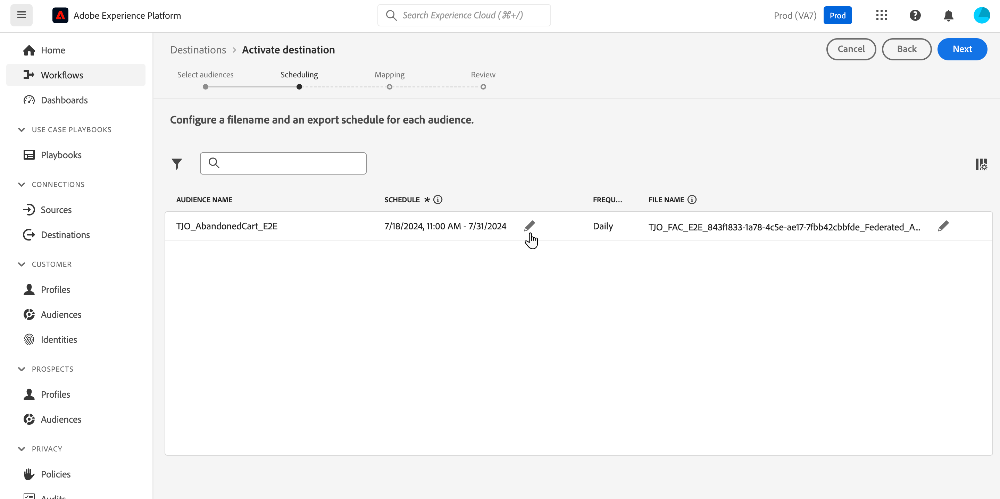

# Enrich Adobe Experience Platform audiences with external data {#connect-aep-fac}

>[!CONTEXTUALHELP]
>id="dc_new_destination"
>title="Create a destination"
>abstract="Enter the settings to connect to the new Federated database. Use the **[!UICONTROL Connect to destination]** button to validate your configuration."

Adobe Experience Platform allows seamless integration of audiences from the Audience Portal with your external databases using the **Adobe Federated Audience Composition destination**. With this integration, you can leverage existing audiences into compositions and enrich or refine them using data from your external databases to create new audiences.

To do so, you need to setup a new connection in Adobe Experience Platform to the Adobe Federated Audience Composition destination. You can use a scheduler to send a given audience at regular frequencies, select specific attributes to include, such as IDs for data reconciliation. If you have applied governance and privacy policies to your audience, they will be kept and sent back to the audience portal once the audience has been updated.

For instance, let's say you are storing purchase information in your data warehouse and have an Adobe Experience Platform audience targeting customers interested in a specific product within the last two months. Using the Federated Audience Composition destination, you can:

* Refine the audience based on purchase information. For example, you can filter the audience to target customers who have made a purchase of more than $150 only.
* Enrich the audience with fields related to purchases such as the product name and the quantity purchased.

## Activate audience to destination {#activate}

Within the Adobe Experience Platform Destinations catalog, select the Federated Audience Composition destination. In the right pane, select **[!UICONTROL Configure new destination]**.

The **[!UICONTROL Configure new destination]** page appears. On this page, you can configure details of your destination, including the name, description, connection type, and federated database.

In the **[!UICONTROL Alerts]** section, you can enable alerts to receive notifications on the status of the dataflow to your destination. These include alerts for dataflow run delays, run failures, run successes, run starts, and activation skips.

For more information on alerts, read the Adobe Experience Platform documentation about [subscribing to destinations alerts using the UI](https://experienceleague.adobe.com/en/docs/experience-platform/destinations/ui/alerts){target="_blank"}.

Once you've finished configuring the details of your destination, select **[!UICONTROL Next]**. The **[!UICONTROL Governance policy & enforcement actions]** step appears. On this page, you can define your data governance policies and ensure that the data used is compliant when audiences are sent and active.

When you finish selecting the desired marketing actions for the destination, select **[!UICONTROL Create]**.

The new connection to the destination is created. You can now activate audiences to send over to the destination. Choose the destination you want to activate the audiences to, followed by **[!UICONTROL Next]**.

The **[!UICONTROL Scheduling]** step is displayed. You can select the desired audiences that you want to activate to the destination. To set up a schedule, select  to edit your export schedule.

The **[!UICONTROL Scheduling]** popover appears. On this popover, you can define your file export options, frequency, and set up your schedule. 

>[!NOTE]
>
>To activate the audiences faster, select the **[!UICONTROL After segment evaluation]** option to trigger the activation job immediately after the daily Platform batch segmentation job finishes.
>
>For detailed information on how to configure schedule and filenames, read the following sections of Adobe Experience Platform documentation:
>
>* [Schedule audience export](https://experienceleague.adobe.com/en/docs/experience-platform/destinations/ui/activate/activate-batch-profile-destinations#scheduling){target="_blank"} 
>* [Configure file names](https://experienceleague.adobe.com/en/docs/experience-platform/destinations/ui/activate/activate-batch-profile-destinations#configure-file-names){target="_blank"} 

In the **[!UICONTROL Mapping]** step, select which attribute and identity fields to export for your audience(s). 

>[!IMPORTANT]
>
>You **cannot** use system-generated columns when activating your destination. Selecting a system-generated column will cause activation to fail.

For more information, read the [mapping section](https://experienceleague.adobe.com/en/docs/experience-platform/destinations/ui/activate/activate-batch-profile-destinations#mapping){target="_blank"} in the Adobe Experience Platform documentation.

Review the destination configuration and audience settings, then select **[!UICONTROL Finish]**.

The selected audiences are now activated for the new connection. You can add more audiences to send with this connection by navigating back to the **[!UICONTROL Activate audiences]** page. You cannot remove audiences once they are activated.
