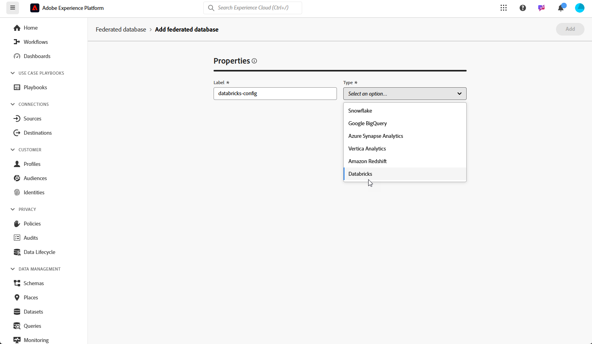

# Configure your Federated databases {#federated-db}

>[!CONTEXTUALHELP]
>id="dc_connection_federated_database_menu"
>title="Federated databases"
>abstract="Existing connections to Federated databases are listed in this screen. To create a new connection, click the **[!UICONTROL Add federated database]** button."

>[!CONTEXTUALHELP]
>id="dc_connection_federated_database_properties"
>title="Federated database properties"
>abstract="Enter the name of the new Federated database, and select its type."

>[!CONTEXTUALHELP]
>id="dc_connection_federated_database_details"
>title="Federated database details"
>abstract="Enter the settings to connect to the new Federated database. Use the **[!UICONTROL Test connection]** button to validate your configuration."

Experience Platform Federated Audience Composition lets you build and enrich audiences from the third-party data warehouses and import the audiences to Adobe Experience Platform.

Learn how to create, configure, test and save the connection to your external database on [this page](connections.md). You can find below the list of supported databases and the detailed settings to configure for each of them.

## Supported databases {#supported-db}

With Federated Audience Composition, you can connect to the following databases. Configuration for each database is detailed below.

* [Amazon Redshift](#amazon-redshift)
* [Azure Synapse Analytics](#azure-synapse)
* [Databricks](#databricks)
* [Google BigQuery](#google-bigquery)
* [Microsoft Fabric](#microsoft-fabric)
* [Snowflake](#snowflake)
* [Vertica Analytics](#vertica-analytics)

## Amazon Redshift {#amazon-redshift}

>[!NOTE]
>
>* Only Amazon Redshift AWS, Amazon Redshift Spectrum, and Amazon Redshift Serverless are supported.
>
>* Secure access to your external Amazon Redshift databases through private link is supported.

Use Federated databases to process information stored in an external database. Follow the steps below to configure access to Amazon Redshift.

1. Under the **[!UICONTROL Federated data]** menu, select **[!UICONTROL Federated databases]**.

1. Click **[!UICONTROL Add federated database]**.

    

1. Enter a **[!UICONTROL Name]** to your Federate database.

1. From the **[!UICONTROL Type]** drop-down, select Amazon Redshift.

    

1. Configure the Amazon Redshift authentication settings:

    * **[!UICONTROL Server]**: Add the name of the DNS.

    * **[!UICONTROL Account]**: Add the username.

    * **[!UICONTROL Password]**: Add the account password.

    * **[!UICONTROL Database]**: Name of your database if not specified in DSN. It can be left empty if specified in the DSN

    * **[!UICONTROL Working schema]**: Name of the database schema to use for work tables. Learn more in [Amazon documentation](https://docs.aws.amazon.com/redshift/latest/dg/r_Schemas_and_tables.html){target="_blank"} 

        >[!NOTE]
        >
        >You can use any schema from the database, including schemas used for temporary data processing, as long as you have the required permission to connect to this schema.
        >
        >**Distinct working schemas** must be used when connecting multiple sandboxes with the same database.

1. Select the **[!UICONTROL Test the connection]** option to verify your configuration.

1. Click **[!UICONTROL Deploy functions]** button to create the functions.

1. Once your configuration is done, click **[!UICONTROL Add]** to create your Federate database.

## Azure Synapse Analytics {#azure-synapse}

Use Federated databases to process information stored in an external database. Follow the steps below to configure access to Azure Synapse Analytics.

1. Under the **[!UICONTROL Federated data]** menu, select **[!UICONTROL Federated databases]**.

1. Click **[!UICONTROL Add federated database]**.

    

1. Enter a **[!UICONTROL Name]** to your Federate database.

1. From the **[!UICONTROL Type]** drop-down, select Azure Synapse Analytics.

    

1. Configure the Azure Synapse Analytics authentication settings:

    * **[!UICONTROL Server]**: Enter the URL of the Azure Synapse server.

    * **[!UICONTROL Account]**: Enter the Username.

    * **[!UICONTROL Password]**: Enter the account password.

    * **[!UICONTROL Database]** (optional): Enter the name of your database if not specified in the DSN.

    * **[!UICONTROL Options]**: The connector supports the options detailed in the table below.

1. Select the **[!UICONTROL Test the connection]** option to verify your configuration.

1. Click **[!UICONTROL Deploy functions]** button to create the functions.

1. Once your configuration is done, click **[!UICONTROL Add]** to create your Federate database.

| Option   |  Description |
|---|---|
| Authentication | Type of authentication supported by the connector. Current supported value: ActiveDirectoryMSI. For more information, refer to [Microsoft SQL documentation](https://learn.microsoft.com/en-us/sql/connect/odbc/using-azure-active-directory?view=sql-server-ver15#example-connection-strings){target="_blank"}  (Example connection strings n°8) |

## Google BigQuery {#google-bigquery}

Use Federated databases to process information stored in an external database. Follow the steps below to configure access to Google BigQuery.

1. Under the **[!UICONTROL Federated data]** menu, select **[!UICONTROL Federated databases]**.

1. Click **[!UICONTROL Add federated database]**.

    

1. Enter a **[!UICONTROL Name]** to your Federate database.

1. From the **[!UICONTROL Type]** drop-down, select Google BigQuery.

    

1. Configure the Google BigQuery authentication settings:

    * **[!UICONTROL Service account]**: Enter the email of your **[!UICONTROL Service account]**. For more information on this, refer to [Google Cloud documentation](https://cloud.google.com/iam/docs/creating-managing-service-accounts){target="_blank"}.

    * **[!UICONTROL Project]**: Enter the ID of your **[!UICONTROL Project]**. For more information on this, refer to [Google Cloud documentation](https://cloud.google.com/resource-manager/docs/creating-managing-projects){target="_blank"}.

    * **[!UICONTROL Dataset]**: Enter the name of your **[!UICONTROL Dataset]**. For more information on this, refer to [Google Cloud documentation](https://cloud.google.com/bigquery/docs/datasets-intro){target="_blank"}.

    * **[!UICONTROL Key file Path]**: Upload your key file to the server. Only .json files are accepted.

    * **[!UICONTROL Options]**: The connector supports the options detailed in the table below.

1. Select the **[!UICONTROL Test the connection]** option to verify your configuration.

1. Click **[!UICONTROL Deploy functions]** button to create the functions.

1. Once your configuration is done, click **[!UICONTROL Add]** to create your Federate database.

| Option   |  Description |
|---|---|
|  ProxyType | Type of proxy used to connect to BigQuery through ODBC and SDK connectors.  HTTP (default), http_no_tunnel, socks4 and socks5 are currently supported. |
|  ProxyHost | Hostname or IP address where the proxy can be reached. |
| ProxyPort | Port number the proxy is running on, e.g. 8080 |
| ProxyUid | Username used for the authenticated proxy |
| ProxyPwd | ProxyUid password |
| bqpath | Note that this is applicable for bulk-load tool only (Cloud SDK).   To avoid using PATH variable or if the google-cloud-sdk directory has to be moved to another location, you can specify with this option the exact path to the cloud sdk bin directory on the server. |
| GCloudConfigName | Note that this is applicable starting release 7.3.4 release and  for bulk-load tool only (Cloud SDK).  The Google Cloud SDK uses configurations to load data into BigQuery tables. The configuration named `accfda` stores the parameters for loading the data. However, this option allows users to specify a different name for the configuration. |
| GCloudDefaultConfigName | Note that this is applicable starting release 7.3.4 release and for bulk-load tool only (Cloud SDK).  The active Google Cloud SDK configuration cannot be deleted without first transferring the active tag to a new configuration. This temporary configuration is necessary to recreate the main configuration for loading data. The default name for the temporary configuration is `default`, this can be changed if needed.|
| GCloudRecreateConfig | Note that this is applicable starting release 7.3.4 release and for bulk-load tool only (Cloud SDK).  When set to `false`, the bulk loading mechanism refrains from attempting to recreate, delete, or modify the Google Cloud SDK configurations. Instead, it proceeds with data loading using the existing configuration on the machine. This feature is valuable when other operations depend on Google Cloud SDK configurations.   If the user enables this engine option without a proper configuration, the bulk loading mechanism will issue a warning message: `No active configuration found. Please either create it manually or remove the GCloudRecreateConfig option`. To prevent further errors, it will then revert to using the default ODBC Array Insert bulk loading mechanism. |

## Snowflake {#snowflake}

>[!NOTE]
>
>Secure access to your external Snowflake data warehouse through private link is supported. Note that your Snowflake account must be hosted on Amazon Web Services (AWS) or Azure and located in the same region as your Federated Audience Composition environment. Please contact your Adobe representative for assistance in setting up secure access to your Snowflake account.
>

Use Federated databases to process information stored in an external database. Follow the steps below to configure access to Snowflake.

1. Under the **[!UICONTROL Federated data]** menu, select **[!UICONTROL Federated databases]**.

1. Click **[!UICONTROL Add federated database]**.

    

1. Enter a **[!UICONTROL Name]** to your Federate database.

1. From the **[!UICONTROL Type]** drop-down, select Snowflake.

    

1. Configure the Snowflake authentication settings:

    * **[!UICONTROL Server]**: Enter your Server name.

    * **[!UICONTROL User]**: Enter your Username.

    * **[!UICONTROL Password]**: Enter your account password.

    * **[!UICONTROL Database]** (optional): Enter the name of your database if not specified in the DSN.

    * **[!UICONTROL Working schema]** (optional): Enter the name of the database schema to use for work tables.

        >[!NOTE]
        >
        >You can use any schema from the database, including schemas used for temporary data processing, as long as you have the required permission to connect to this schema.
        >
        >**Distinct working schemas** must be used when connecting multiple sandboxes with the same database.

    * **[!UICONTROL Private key]**: Click the **[!UICONTROL Private key]** field to select your .pem files from your locale folder.

    * **[!UICONTROL Options]**: The connector supports the options detailed in the table below.

1. Select the **[!UICONTROL Test the connection]** option to verify your configuration.

1. Click **[!UICONTROL Deploy functions]** button to create the functions.

1. Once your configuration is done, click **[!UICONTROL Add]** to create your Federate database.

The connector supports the following options:

| Option   |  Description |
|---|---|
|  workschema | Database schema to use for work tables |
|  warehouse | Name of the default warehouse to use. It will override the user's default. |
|  TimeZoneName |  By default empty, which means that the system time zone app server is used. The option can be used to force the TIMEZONE session parameter.  For more about this, refer to [this page](https://docs.snowflake.net/manuals/sql-reference/parameters.html#timezone){target="_blank"}. |
|  WeekStart |  WEEK_START session parameter. By default set to 0.  For more about this, refer to [this page](https://docs.snowflake.com/en/sql-reference/parameters.html#week-start){target="_blank"}. |
|  UseCachedResult | USE_CACHED_RESULTS session parameter. By default set to TRUE. This option can be used to disable Snowflake cached results.  For more about this, refer to [this page](https://docs.snowflake.net/manuals/user-guide/querying-persisted-results.html){target="_blank"}. |
|  bulkThreads | Number of threads to use for Snowflake bulk-loader, more threads mean a better performance for bigger bulk-loads. By default set to 1. The number can be adjusted, depending on the machine thread count. |
|  chunkSize | Determines the file size of the bulk-loader chunk. By default set to 128MB. Can be modified for a more optimal performance, when used with bulkThreads. More concurrently active threads mean better performance.  For more about this, refer to [Snowflake documentation](https://docs.snowflake.net/manuals/sql-reference/sql/put.html){target="_blank"}. |
| StageName | Name of the pre-provisioned internal stage. It will be used in bulk load instead of creating a new temporary stage.|

## Vertica Analytics {#vertica-analytics}

Use Federated databases to process information stored in an external database. Follow the steps below to configure access to Vertica Analytics.

1. Under the **[!UICONTROL Federated data]** menu, select **[!UICONTROL Federated databases]**.

1. Click **[!UICONTROL Add federated database]**.

    

1. Enter a **[!UICONTROL Name]** to your Federate database.

1. From the **[!UICONTROL Type]** drop-down, select Vertica Analytics.

    

1. Configure the Vertica Analytics authentication settings:

    * **[!UICONTROL Server]**: Add the URL of the [!DNL Vertica Analytics] server.

    * **[!UICONTROL Account]**: Add the Username.

    * **[!UICONTROL Password]**: Add the account password.

    * **[!UICONTROL Database]** (optional): Enter the name of your database if not specified in the DSN.

    * **[!UICONTROL Working schema]** (optional): Enter the name of the database schema to use for work tables.

        >[!NOTE]
        >
        >You can use any schema from the database, including schemas used for temporary data processing, as long as you have the required permission to connect to this schema.
        >
        >**Distinct working schemas** must be used when connecting multiple sandboxes with the same database.

    * **[!UICONTROL Options]**: The connector supports the options detailed in the table below.

1. Select the **[!UICONTROL Test the connection]** option to verify your configuration.

1. Click **[!UICONTROL Deploy functions]** button to create the functions.

1. Once your configuration is done, click **[!UICONTROL Add]** to create your Federate database.

The connector supports the following option:

| Option   |  Description |
|---|---|
|  TimeZoneName |  By default empty, which means that the system time zone of the app server is used. The option can be used to force the TIMEZONE session parameter. |

## Databricks {#databricks}

>[!NOTE]
>
>Secure access to your external Databricks data warehouse through private link is supported. This includes secure connections to Databricks databases hosted on Amazon Web Services (AWS) via private link and Databricks databases hosted on Microsoft Azure via VPN. Please contact your Adobe representative for assistance in setting up secure access.

Use Federated databases to process information stored in an external database. Follow the steps below to configure access to Databricks.

1. Under the **[!UICONTROL Federated data]** menu, select **[!UICONTROL Federated databases]**.

1. Click **[!UICONTROL Add federated database]**.

    

1. Enter a **[!UICONTROL Name]** to your Federate database.

1. From the **[!UICONTROL Type]** drop-down, select Databricks.

    

1. Configure the Databricks authentication settings:

    * **[!UICONTROL Server]**: Add the name of your Databricks server.

    * **[!UICONTROL HTTP path]**: Add the path to your Cluster or Warehouse. [Learn more](https://docs.databricks.com/en/integrations/compute-details.html){target="_blank"}

    * **[!UICONTROL Password]**: Add the account access token. [Learn more](https://docs.databricks.com/en/dev-tools/auth/pat.html){target="_blank"}

    * **[!UICONTROL Catalog]**: Add the field for the Databricks Catalog.

    * **[!UICONTROL Working schema]**: Name of the database schema to use for work tables.

        >[!NOTE]
        >
        >You can use any schema from the database, including schemas used for temporary data processing, as long as you have the required permission to connect to this schema.
        >
        >**Distinct working schemas** must be used when connecting multiple sandboxes with the same database.

    * **[!UICONTROL Options]**: The connector supports the options detailed in the table below.

1. Select the **[!UICONTROL Test the connection]** option to verify your configuration.

1. Click **[!UICONTROL Deploy functions]** button to create the functions.

1. Once your configuration is done, click **[!UICONTROL Add]** to create your Federate database.

The connector supports the following options:

| Option   |  Description |
|---|---|
|  TimeZoneName |  By default empty, which means that the system time zone of the app server is used. The option can be used to force the TIMEZONE session parameter. |

## Microsoft Fabric {#microsoft-fabric}

Use Federated databases to process information stored in an external database. Follow the steps below to configure access to Microsoft Fabric.

1. Under the **[!UICONTROL Federated data]** menu, select **[!UICONTROL Federated databases]**.

1. Click **[!UICONTROL Add federated database]**.

    

1. Enter a **[!UICONTROL Name]** to your Federate database.

1. From the **[!UICONTROL Type]** drop-down, select Microsoft Fabric.

    

1. Configure the Microsoft Fabric authentication settings:

    * **[!UICONTROL Server]**: Enter the URL of the Microsoft Fabric server.

    * **[!UICONTROL Application ID]**: Enter your Microsoft Fabric Application ID.

    * **[!UICONTROL Client secret]**: Enter your Client secret.

    * **[!UICONTROL Options]**: The connector supports the options detailed in the table below.

1. Click **[!UICONTROL Server IPs]** to select the Server IPs you want to authorize.

1. Select the **[!UICONTROL Test the connection]** option to verify your configuration.

1. Click **[!UICONTROL Deploy functions]** button to create the functions.

1. Once your configuration is done, click **[!UICONTROL Add]** to create your Federate database.

| Option | Description |
| ------ | ----------- |
| Authentication | Type of authentication supported by the connector. Current supported value: ActiveDirectoryMSI. For more information, refer to [Microsoft SQL documentation](https://learn.microsoft.com/en-us/sql/connect/odbc/using-azure-active-directory?view=sql-server-ver15#example-connection-strings){target="_blank"}  (Example connection strings n°8) |

