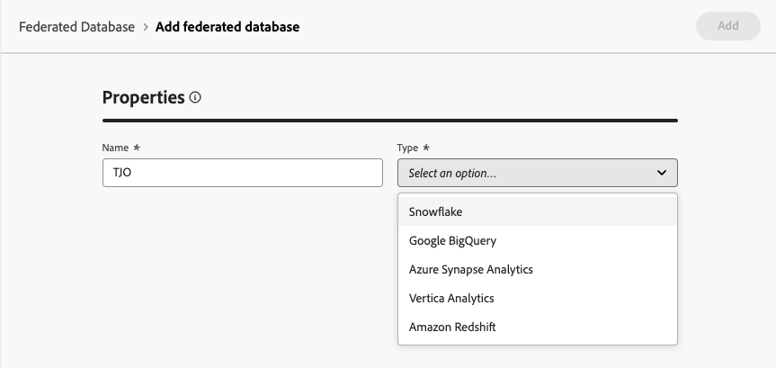

# Create connections {#connections-fdb}

>[!AVAILABILITY]
>
>To access connections, you'll need one of the following permissions:
>
>-**Manage Federated Database**
>-**View Federated Database**
>
>For more information on the required permissions, please read the [access control guide](/help/governance-privacy-security/access-control.md).

Experience Platform Federated Audience Composition lets you build and enrich audiences from the third-party data warehouses and import the audiences to Adobe Experience Platform.

## Supported databases {#supported-databases}

To work with your federated database and Adobe Experience Platform, you must first establish a connection between the two sources. With Federated Audience Composition, you can connect to the following databases.

* [Amazon Redshift](#amazon-redshift)
* [Azure Synapse Analytics](#azure-synapse)
* [Databricks](#databricks)
* [Google BigQuery](#google-bigquery)
* [Microsoft Fabric](#microsoft-fabric)
* [Oracle](#oracle)
* [Snowflake](#snowflake)
* [Vertica Analytics](#vertica-analytics)

## Create connection {#create}

To create a connection, select **Federated Databases** within the Federated data section.

IMAGE

The Federated databases section appears. Select **[!UICONTROL Add federated database]** to create a connection.

{zoomable="yes"}

The connection properties popover appears. You can name your connection as well as select what type of database you want to create.

{zoomable="yes"}

After selecting a type, the **Details** section appears. This section differs based on the database type previously chosen.

{zoomable="yes"}

>[!BEGINTABS]

>[!TAB Amazon Redshift]

>[!AVAILABILITY]
>
>Only Amazon Redshift AWS, Amazon Redshift Spectrum, and Amazon Redshift Serverless are supported.

After selecting Amazon Redshift, you can add the following details: 

| Field | Description |
| ----- | ----------- |
| Server | The name of the data source. |
| Account | The account's username. |
| Password | The account's password. |
| Database | The name of the database. If this is specified in the server name, this field can be left blank. |
| Working schema | The name of the database's schema to use for work tables. More information about this feature can be found in the [Amazon Schemas documentation](https://docs.aws.amazon.com/redshift/latest/dg/r_Schemas_and_tables.html){target="_blank"}.  **Note:** You can use any schema from the database, including schemas used for temporary data processing, as long as you have the required permissions to connect to this schema. However, you **must** use distinct working schemas when connecting multiple sandboxes with the same database. |

>[!TAB Azure Synapse Analytics]

After selecting Azure Synapse Analytics, you can add the following details:

| Field | Description |
| ----- | ----------- |
| Server | The URL of the Azure Synapse server. |
| Account | The username for the Azure Synapse account. |
| Password | The password for the Azure synapse account. |
| Database | The name of the database. If this is specified in the server name, this field can be left blank. |
| Options | Additional options for the connection. For Azure Synapse Analytics, you can specify the type of authentication supported by the connector. Currently, Federated Audience Composition supports `ActiveDirectoryMSI`. For more information about connection strings, please read the [example connection strings section within Microsoft's documentation](https://learn.microsoft.com/en-us/sql/connect/odbc/using-azure-active-directory?view=sql-server-ver15#example-connection-strings){target="_blank"} . |

>[!TAB Databricks]

>[!NOTE]
>
>Secure access to your external Databricks data warehouse through private link is supported. This includes secure connections to Databricks databases hosted on Amazon Web Services (AWS) via private link and Databricks databases hosted on Microsoft Azure via VPN. Please contact your Adobe representative for assistance in setting up secure access.

After selecting Databricks, you can add the following details:

| Field | Description |
| ----- | ----------- |
| Server | The name of the Databricks server. |
| HTTP path | The path to your Cluster or Warehouse. For more information on the path, please read the [Databricks documentation on connection details](https://docs.databricks.com/aws/en/integrations/compute-details){target="_blank"}. |
| Password | The access token for the Databricks server. For more information on this value, please read the [Databricks documentation on personal access tokens](https://docs.databricks.com/aws/en/dev-tools/auth/pat){target="_blank"}.  |
| Catalog | The name of the Databricks Catalog. For more information on catalogs in Databricks, please read the [Databricks documentation on catalogs](https://docs.databricks.com/aws/en/catalogs/){target="_blank"} |
| Working schema | The name of the database schema to use for the work tables.   **Note:** You can use **any** schema from the database, including schemas used for temporary data processing, as long as you have the required permissions to connect to this schema. However, you **must** use distinct working schemas when connecting multiple sandboxes with the same database. |
| Options | Additional options for the connection. The available options are listed in the following table. |

For Databricks, you can set the following additional options: 

| Options | Description |
| ------- | ----------- |
| TimeZoneName | The name of the time zone to use. This value represents the `TIMEZONE` session parameter. For more information on time zones, please read the [Databricks documentation on timezones](https://docs.databricks.com/aws/en/sql/language-manual/parameters/timezone#:~:text=The%20system%20default%20is%20UTC%20.){target="_blank"}. |

>[!TAB Google BigQuery]

After selecting Google BigQuery, you can add the following details:

| Field | Description |
| ----- | ----------- |
| Service account | The email address of your service account. For more information, please read the [Google Cloud service account documentation](https://cloud.google.com/iam/docs/service-accounts-create){target="_blank"}. |
| Project | The ID of your project. For more information, please read the [Google Cloud project documentation](https://cloud.google.com/resource-manager/docs/creating-managing-projects){target="_blank"}. |
| Dataset | The name of the dataset. For more information, please read the [Google Cloud dataset documentation](https://cloud.google.com/bigquery/docs/datasets-intro){target="_blank"}. |
| Key file path | The key file to the server. Only `json` files are supported. |
| Options | Additional options for the connection. The available options are listed in the following table. |

For Google BigQuery, you can set the following additional options:

| Options | Description |
| ------- | ----------- |
| ProxyType | The type of proxy used to connect to BigQuery. Supported values include `HTTP`, `http_no_tunnel`, `socks4`, and `socks5`. |
| ProxyHost | The hostname or IP address where the proxy can be reached. |
| ProxyUid | The port number that the proxy is running on. |
| ProxyPwd | The password for the proxy. |
| bgpath | **Note:** This is only applicable for the **bulk-load tool** (Cloud SDK).    The path to the Cloud SDK bin directory on the server. You only need to set this if you've moved the `google-cloud-sdk` directory to another location or if you want to avoid using the PATH variable. |
| GCloudConfigName | **Note:** This is only applicable for the **bulk-load tool** (Cloud SDK) above version 7.3.4.    The name of the configuration that stores the parameters for loading the data. By default, this value is `accfda`. |
| GCloudDefaultConfigName | **Note:** This is only applicable for the **bulk-load tool** (Cloud SDK) above version 7.3.4.    The name of the temporary configuration to recreate the main configuration for loading data. By default, this value is `default`. |
| GCloudRecreateConfig | **Note:** This is only applicable for the **bulk-load tool** (Cloud SDK) above version 7.3.4.    A boolean value that lets you decide if the bulk loading mechanism should automatically recreate, delete, or modify the Google Cloud SDK configurations. If this value is set to `false`, the bulk loading mechanism loads data using an existing configuration on the machine. If this value is set to `true`, ensure your configuration is properly set up - otherwise, the `No active configuration found. Please either create it manually or remove the GCloudRecreateConfig option` error will appear, and the loading mechanism will revert to the default loading mechanism. |

>[!TAB Microsoft Fabric]

After selecting Microsoft Fabric, you can add the following details:

| Field | Description |
| ----- | ----------- |
| Server | The URL for the Microsoft Fabric server. |
| Application ID | The application ID for Microsoft Fabric. For more information about the application ID, please read the [Microsoft Fabric documentation on application setup](https://learn.microsoft.com/en-us/fabric/workload-development-kit/create-entra-id-app){target="_blank"}. |
| Client secret | The client secret for the application. For more information about the client secret, please read the [Microsoft Fabric documentation on application setup](https://learn.microsoft.com/en-us/fabric/workload-development-kit/create-entra-id-app#step-8-generate-a-secret-for-your-application){target="_blank"}. |
| Options | Additional options for the connection. The available options are listed in the following table. |

For Microsoft Fabric, you can set the following additional options:

| Option | Description |
| ------ | ----------- |
| Authentication | The type of authentication used by the connector. Supported values include: `ActiveDirectoryMSI`. For more information, please read the [Microsoft documentation on warehouse connectivity](https://learn.microsoft.com/en-us/fabric/data-warehouse/connectivity){target="_blank"}. |

>[!TAB Oracle]

>[!IMPORTANT]
>
>The Oracle database connector can currently **only** be used for audience creation and audience enrichment use cases. 
>
>Additionally, before setting up your Oracle database, please contact your Adobe Customer Care representative. 

After selecting Oracle, you can add the following details:

| Field | Description |
| ----- | ----------- |
| Server | The URL for the Oracle server. |
| Account | The username of the account. |
| Password | The password of the account. |

>[!TAB Snowflake]

>[!NOTE]
>
>Secure access to your external Snowflake data warehouse through private link is supported. Note that your Snowflake account must be hosted on Amazon Web Services (AWS) or Azure and located in the same region as your Federated Audience Composition environment. Please contact your Adobe representative for assistance in setting up secure access to your Snowflake account.

After selecting Snowflake, you can add the following details:

| Field | Description |
| ----- | ----------- |
| Server | The name of the server. |
| User | The username for the account. |
| Password | The password for the account. |
| Database | The name of the database. If this is specified in the server name, this field can be left blank. |
| Working schema | The name of the database schema to use for the work tables.   **Note:** You can use **any** schema from the database, including schemas used for temporary data processing, as long as you have the required permissions to connect to this schema. However, you **must** use distinct working schemas when connecting multiple sandboxes with the same database. |
| Private key | The private key for your database connection. You can upload a `.pem` file from your local system. |
| Options | Additional options for the connection. The available options are listed in the following table. |

For Snowflake, you can set the following additional options:

| Options | Description |
| ------- | ----------- |
| workschema | The name of the database schema to use for work tables. |
| TimeZoneName | The name of the time zone to use. This value represents the `TIMEZONE` session parameter. By default, the system time zone will be used. For more information on time zones, please read the [Snowflake documentation on timezones](https://docs.snowflake.com/en/sql-reference/parameters#timezone){target="_blank"}. |
| WeekStart | The day that you want the week to start. This value represents the `WEEK_START` session parameter. For more information on week start, please read the [Snowflake documentation on the week start parameter](https://docs.snowflake.com/en/sql-reference/parameters#week-start){target="_blank"}|
| UseCachedResult | A boolean that determines if Snowflake's cached results will be used. This value represents the `USE_CACHED_RESULTS` session parameter. By default, this value is set to true. For more information on this parameter, please read the [Snowflake documentation on persisting results](https://docs.snowflake.com/en/user-guide/querying-persisted-results){target="_blank"}. |
| bulkThreads | The number of threads to use for Snowflake's bulk loader. The more threads added, the better the performance will be for bigger bulk loads. By default, this value is set to 1. |
| chunkSize | The file size of the each bulk loader's chunk. When used concurrently with more threads, you can improve the performance of your bulk loads. By default, this value is set to 128 MB. For more information about chunk sizes, please read the [Snowflake documentation on preparing data files](https://docs.snowflake.com/en/user-guide/data-load-considerations-prepare){target="_blank"}. |
| StageName | The name of a pre-provisioned internal staging enviornment. This can be used in bulk loads instead of creating a new temporary stage. |

>[!TAB Vertica Analytics]

After selecting Vertica Analytics, you can add the following details:

| Field | Description |
| ----- | ----------- |
| Server | The URL of the Vertica Analytics server. |
| Account | The username of the account. |
| Password | The password of the account. |
| Database | The name of the database. If this is specified in the server name, this field can be left blank. |
| Working schema | The name of the database schema to use for the work tables.   **Note:** You can use **any** schema from the database, including schemas used for temporary data processing, as long as you have the required permissions to connect to this schema. However, you **must** use distinct working schemas when connecting multiple sandboxes with the same database. |
| Options | Additional options for the connection. The available options are listed in the following table. |

For Vertica Analytics, you can set the following additional options:

| Options | Description |
| ------- | ----------- |
| TimeZoneName | The name of the time zone to use. This value represents the `TIMEZONE` session parameter. For more information on timezones, please read the [Vertica Analytics documentation on timezones](https://docs.vertica.com/24.1.x/en/admin/configuring-db/config-procedure/using-time-zones-with/){target="_blank"} |

>[!ENDTABS]

After adding the connection's details, please note the following additional settings:

>[!NOTE]
>
>To use Federated Audience Composition for a given database, you must allow list **all** of the IP addresses associated with that database.

| Settings | Details |
| -------- | ------- |
| Enable connection | A boolean toggle that determines whether the connection will automatically be enabled. |
| Server IPs | A popover that displays what IP addresses need to be allowlisted to connect to the database. |
| Test connection | Lets you verify your configuration details. |

You can now select **[!UICONTROL Deploy functions]**, followed by **[!UICONTROL Add]** to finalize the connection between the federated database and Experience Platform.

