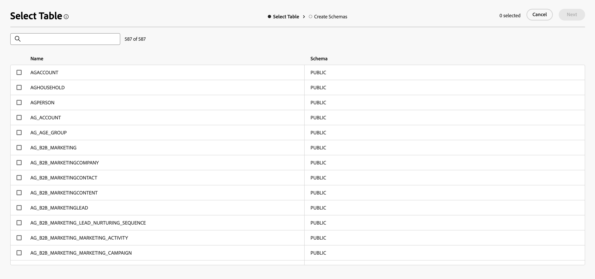

# Get started with schemas {#schemas}

>[!AVAILABILITY]
>
>To access schemas, you'll need one of the following permissions:
>
>-**Manage Federated Schema**
>-**View Federated Schema**
>
>For more information on the required permissions, please read the [access control guide](/help/governance-privacy-security/access-control.md).

>[!CONTEXTUALHELP]
>id="dc_schema_create_select_tables"
>title="Select tables"
>abstract="Select the tables to add for the data model."

>[!CONTEXTUALHELP]
>id="dc_schema_create_key"
>title="Key"
>abstract="Select a key for data reconciliation."

>[!CONTEXTUALHELP]
>id="dc_schema_create_schema_name"
>title="Name of the schema"
>abstract="Enter the name of the schema."

>[!CONTEXTUALHELP]
>id="dc_schema_edit_description"
>title="Schema description"
>abstract="The schema description lists columns, types and labels. You can also check the reconciliation key for the schema. To update the schema definition, click the pencil icon."

>[!CONTEXTUALHELP]
>id="dc_schema_filter_sources"
>title="Select the source database to filter"
>abstract="You can filter the schemas based on their source. Select one or several Federated databases to displays their schemas."

## What is a schema {#schema-start}

A schema is a representation of a table of your database. It is an object within the application that defines how the data are tied to database tables. 

By creating a schema, you can define a representation of your table in Experience Platform Federated Audience Composition: 

* Give it a friendly name and description to simplify the comprehension for the user
* Decide the visibility of each field, according to their real use 
* Select its primary key, in order to link schemas between them, as needed in the [data model](../data-management/gs-models.md#data-model-start)

>[!CAUTION]
>
>When connecting multiple sandboxes with same database, you must use distinct working schemas.

## Create a schema {#schema-create}

To create a schema in Federated Audience Composition, select **[!UICONTROL Models]** in the **[!UICONTROL Federated Data]** section. Within the **[!UICONTROL Schema]** tab, select **[!UICONTROL Create schema]**.

{zoomable="yes"}

The **[!UICONTROL Select federated database]** popover appears. On this popover, you can select the [source database](/help/connections/home.md), followed by **[!UICONTROL Next]**.

{zoomable="yes"}

The **Select Table** popover appears. On this popover, you can select the tables which you want to use to create the schema.

{zoomable="yes"}

Each selected table generates a schema with the chosen columns. For each table, you can change the label of the schema, add a description, rename the field label, set the field label visibility, and select the schema primary key.

{zoomable="yes"}

>[!NOTE]
>
>If you enable **[!UICONTROL Use Composite Key]** but only select one key to be used, the key will be treated like a standard schema primary key.

Additionally, you can create a key that is made up of multiple schema columns. Turn on **[!UICONTROL Use Composite Key]**, and mark the keys you want to use as your composite key.

{zoomable="yes"}

After completing your configuration, select **[!UICONTROL Done]** to finish creating your schema. 

## Edit a schema {#schema-edit}

To edit a schema, select your previously created schema on the **Schemas** page.

The schema details page appears. Select the  to edit the schema.

{zoomable="yes"}

On the **[!UICONTROL Edit schema]** window, you can access and configure the same options as when [creating a schema](#schema-create).

{zoomable="yes"}

## Preview data in a schema {#schema-preview}

To preview the data in the table represented by your schema, browse to the **[!UICONTROL Data]** tab as below.

Select **[!UICONTROL Calculate]** link to preview the total number of recordings.

{zoomable="yes"}

Select the **[!UICONTROL Configure columns]** button to change the data display.

{zoomable="yes"}

## Refresh a schema {#schema-refresh}

Tables in a federated database can be updated, added or removed. In such cases, you must refresh the schema in Adobe Experience Platform to align with the latest changes. To perform this, select the  next to the name of the schema followed by **[!UICONTROL Refresh schema]**. 

You can also update the schema definition when editing it.

{zoomable="yes"}

## Delete a schema {#schema-delete}

To delete a schema, select the , followed by **[!UICONTROL Delete]**.

{zoomable="yes"}
