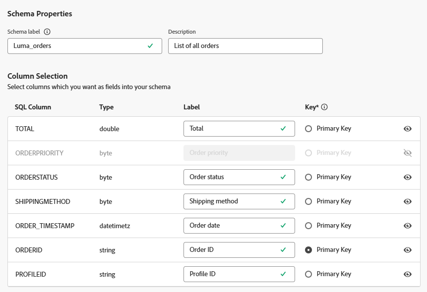
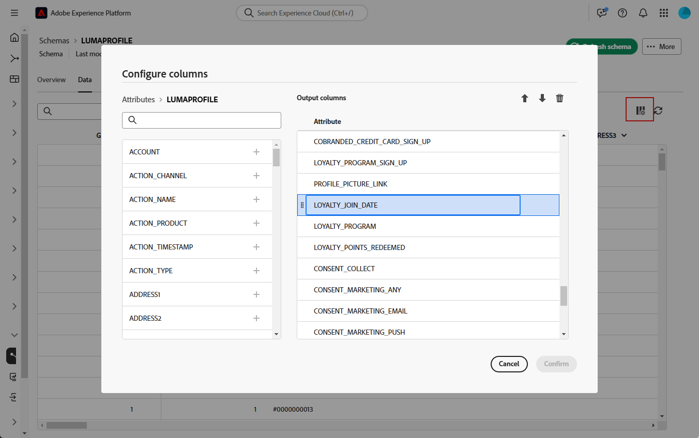

# Get started with schemas {#schemas}

>[!AVAILABILITY]
>
>To access schemas, you'll need one of the following permissions:
>
>-**Manage Federated Schema**
>-**View Federated Schema**
>
>For more information on the required permissions, please read the [Access Federated Audience Composition guide](/help/start/feature-access.md).

>[!CONTEXTUALHELP]
>id="dc_schema_create_select_tables"
>title="Select tables"
>abstract="Select the tables to add for the data model."

>[!CONTEXTUALHELP]
>id="dc_schema_create_key"
>title="Key"
>abstract="Select a key for data reconciliation."

>[!CONTEXTUALHELP]
>id="dc_schema_create_schema_name"
>title="Name of the schema"
>abstract="Enter the name of the schema."

>[!CONTEXTUALHELP]
>id="dc_schema_edit_description"
>title="Schema description"
>abstract="The schema description lists columns, types and labels. You can also check the reconciliation key for the schema. To update the schema definition, click the pencil icon."

>[!CONTEXTUALHELP]
>id="dc_schema_filter_sources"
>title="Select the source database to filter"
>abstract="You can filter the schemas based on their source. Select one or several Federated databases to displays their schemas."

## What is a schema {#schema-start}

A schema is a representation of a table of your database. It is an object within the application that defines how the data are tied to database tables. 

By creating a schema, you can define a representation of your table in Experience Platform Federated Audience Composition: 

* Give it a friendly name and description to simplify the comprehension for the user
* Decide the visibility of each field, according to their real use 
* Select its primary key, in order to link schemas between them, as needed in the [data model](../data-management/gs-models.md#data-model-start)

>[!CAUTION]
>
>When connecting multiple sandboxes with same database, you must use distinct working schemas.
>

## Create a schema {#schema-create}

To create schemas in Federated Audience Composition, follow the steps below:

1. In **[!UICONTROL Federated Data]** section, access the **[!UICONTROL Models]** menu. Browse to the **[!UICONTROL Schema]** tab and click **[!UICONTROL Create schema]**.

    {zoomable="yes"}

    This step lets you access to a new screen with a drop-down list where you can find the database(s) connected to your environment. Learn more about database connection in [this section](../connections/connections.md#connections-fdb).

1. Select your source database in the list, and click **[!UICONTROL Next]**.

    {zoomable="yes"}

    You can then see the list of all the tables in the database.

1. Select the tables for which you want to create the schema.

1. Each selected table generates a schema with the chosen columns. Configure the schema and its columns as needed.

    {zoomable="yes"}

    For each table, you can:

    * change the label of the schema
    * add a description
    * rename all the field labels, and set their visibility
    * select the schema primary key

    The schema can be defined as follows:

    

1. After completing your configuration, click **[!UICONTROL Done]**. 

## Edit a schema {#schema-edit}

To edit a schema, follow these steps:

1. Access your previously created schema.

1. Click on **[!UICONTROL Edit]** button.

    {zoomable="yes"}

1. From the **[!UICONTROL Edit schema]** window, you can access and configure the same options as when [creating a schema](#schema-create).

    {zoomable="yes"}

## Preview data in a schema {#schema-preview}

To preview the data in the table represented by your schema, browse to the **[!UICONTROL Data]** tab as below.

Click on the **[!UICONTROL Calculate]** link to preview the total number of recordings.

{zoomable="yes"}

Click on the **[!UICONTROL Configure columns]** button to change the data display.

{zoomable="yes"}

## Refresh a schema {#schema-refresh}

Tables in a federated database can be updated, added or removed. In such cases, you must refresh the schema in Adobe Experience Platform to align with the latest changes. To perform this, click the three dots next to the name of the schema to update and select **Refresh schema**. 

You can also update the schema definition when editing it.

{zoomable="yes"}

## Delete a schema {#schema-delete}

To delete a schema, click on **[!UICONTROL More]** button, then choose **[!UICONTROL Delete]**.

{zoomable="yes"}
