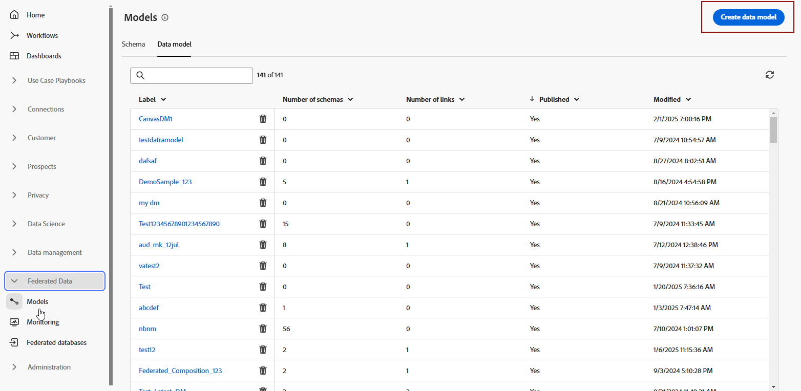
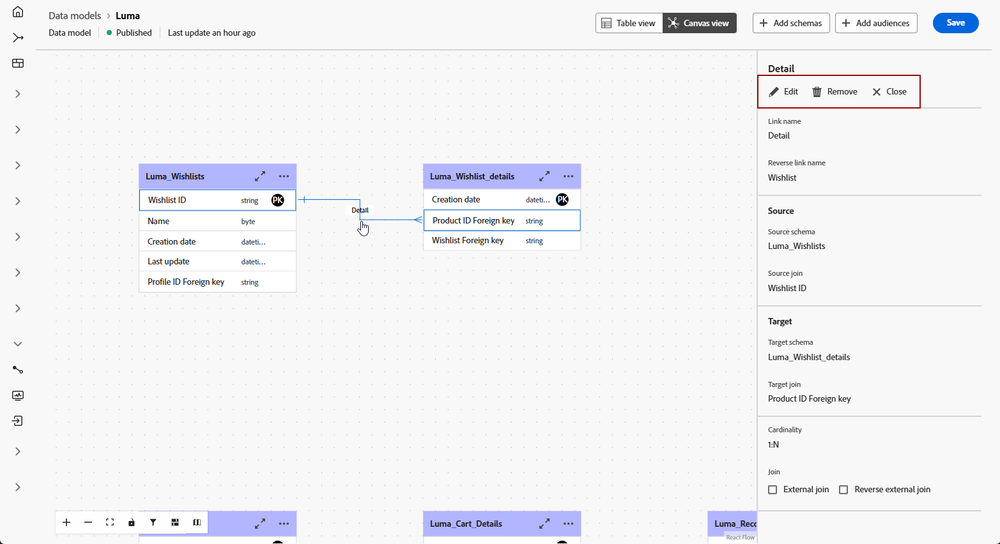

# Get started with data models {#data-model-beta}

>[!AVAILABILITY]
>
>To access data models, you'll need one of the following permissions:
>
>-**Manage Federated Data Model**
>-**View Federated Data Model**
>
>For more information on the required permissions, please read the [Access Federated Audience Composition guide](/help/start/feature-access.md).

# Get started with data models {#data-model}

## What is a data model {#data-model-start}

A data model is a set of schemas, audiences, and the links between them. It is used to federate audiences with databases data.

In Federated Audience Composition, you can create and manage data models directly in the Canvas view. This includes adding schemas and audiences, as well as defining the links between them based on your use case.

Learn more about [schemas](../customer/schemas.md#schema-start) and [audiences](../start/audiences.md).

For example, you can see below a representation of a data model: the tables with their name and the links between them.

{zoomable="yes"}

## Create a data model {#data-model-create}

To create a data model, follow these steps:

1. In the **[!UICONTROL Federated Data]** section, access the **[!UICONTROL Models]** menu, and browse to the **[!UICONTROL Data model]** tab. 

    Click on the **[!UICONTROL Create data model]** button.

    {zoomable="yes"}

1. Define the name your data model, and click on the **[!UICONTROL Create]** button.

1. From your data model dashboard, click **[!UICONTROL Add schemas]** to choose the schema associated with your data model.

    {zoomable="yes"}

1. Click **[!UICONTROL Add Audiences]** to define your target groups.

1. Establish connections between tables in your data model to ensure accurate data relationships. [Learn more](#data-model-links)

1. After completing the configuration, click **[!UICONTROL Save]** to apply your changes.

## Create links {#data-model-links}

>[!BEGINTABS]

>[!TAB Table view]

To create links between tables of your datamodel from the Table view tab, follow these steps: 

1. Click  on **[!UICONTROL Create link]** menu of one of the table, or click on **[!UICONTROL Create links]** button, and choose the 2 tables:

    {zoomable="yes"}

1. Fill in the given form to define the link.

    {zoomable="yes"}

    **Cardinality**

     * **1-N**: one occurrence of the source table can have several corresponding occurrences of the target table, but one occurrence of the target table can have at most one corresponding occurrence of the source table.

     * **N-1**: one occurrence of the target table can have several corresponding occurrences of the source table, but one occurrence of the source table can have at most one corresponding occurrence of the target table.
     
     * **1-1**: one occurrence of the source table can have at most one corresponding occurrence of the target table.

All the links defined for your datamodel are listed as below:

{zoomable="yes"}

>[!TAB Canvas view]

To create links between tables of your datamodel from the Canvas view tab, follow these steps: 

1. Access the Canvas view of your data model and choose the two tables you want to link

1. Click the  button next to the Source Join, then drag and guide the arrow towards the Target Join to establish the connection.

    {zoomable="yes"}

1. Fill in the given form to define the link and click **[!UICONTROL Apply]** once configured.

    {zoomable="yes"}

    **Cardinality**

     * **1-N**: one occurrence of the source table can have several corresponding occurrences of the target table, but one occurrence of the target table can have at most one corresponding occurrence of the source table.

     * **N-1**: one occurrence of the target table can have several corresponding occurrences of the source table, but one occurrence of the source table can have at most one corresponding occurrence of the target table.
     
     * **1-1**: one occurrence of the source table can have at most one corresponding occurrence of the target table.

1. All links defined in your data model are represented as arrows in the canvas view. Click on an arrow between two tables to view details, make edits, or remove the link as needed.

    {zoomable="yes"}

1. Use the toolbar to customize and adjust your canvas.

    

    * **[!UICONTROL Zoom in]**: Magnify the canvas to see details of your data model more clearly.
    * **[!UICONTROL Zoom out]**: Reduce the canvas size for a broader view of your data model.
    * **[!UICONTROL Fit view]**: Adjust the zoom to fit all schemas and/or audiences within the visible area.
    * **[!UICONTROL Toggle interactivity]**: Enable or disable user interaction with the canvas.
    * **[!UICONTROL Filter]**: Choose which schema to display within the canvas.
    * **[!UICONTROL Force auto layout]**: Automatically arrange schemas and/or audiences for better organization.

>[!ENDTABS]

## How to video {#data-model-video}

Learn how to create a data model in this video:

>[!VIDEO](https://video.tv.adobe.com/v/3432020)
