# Models overview

>[!AVAILABILITY]
>
>To access data models, you'll need one of the following permissions:
>
>-**Manage Federated Data Model**
>-**View Federated Data Model**
>
>For more information on the required permissions, please read the [access control guide](/help/governance-privacy-security/access-control.md).

A data model is a set of schemas, audiences, and the links between them. You can use models to combine your database's data into your audiences.

In Federated Audience Composition, you can create and manage data models directly in the Canvas view. This includes adding schemas and audiences, as well as defining the links between them based on your use case.

To learn more about schemas, read the [schemas overview](../data-modelling/schemas.md). To learn more about audiences, read the [work with audiences guide](../start/audiences.md).

For example, you can see below a representation of a data model: the tables with their name and the links between them.

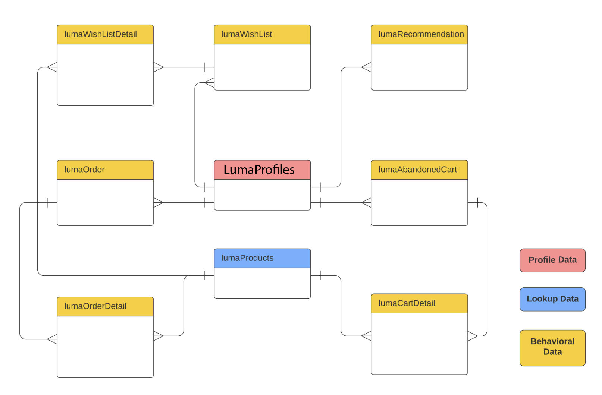{zoomable="yes"}

## Create a data model {#data-model-create}

To create a data model, follow these steps:

1. In the **[!UICONTROL Federated Data]** section, access the **[!UICONTROL Models]** menu, and browse to the **[!UICONTROL Data model]** tab. 

    Select the **[!UICONTROL Create data model]** button.

    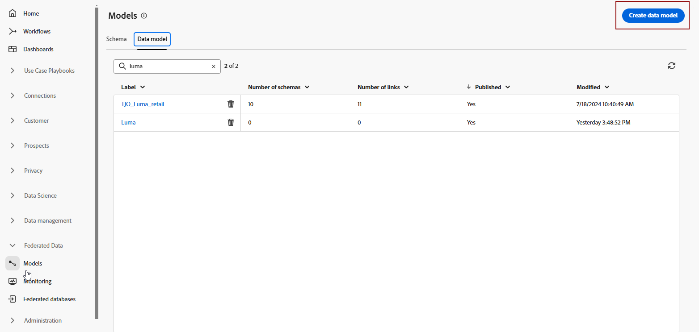{zoomable="yes"}

2. Define the name of your data model, and select **[!UICONTROL Create]** button.

3. From your data model dashboard, select **[!UICONTROL Add schemas]** to choose the schema associated with your data model.

    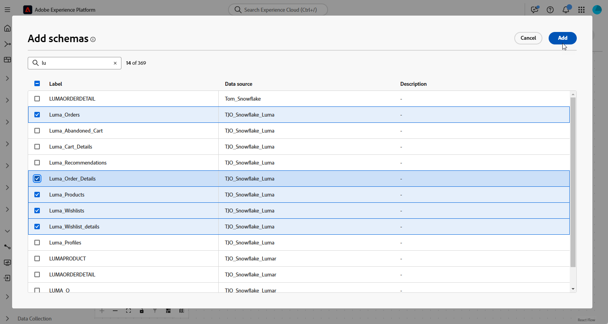{zoomable="yes"}

4. Additionally, you can add audiences to your data model. Select **[!UICONTROL Add Audiences]** to define your target groups.

    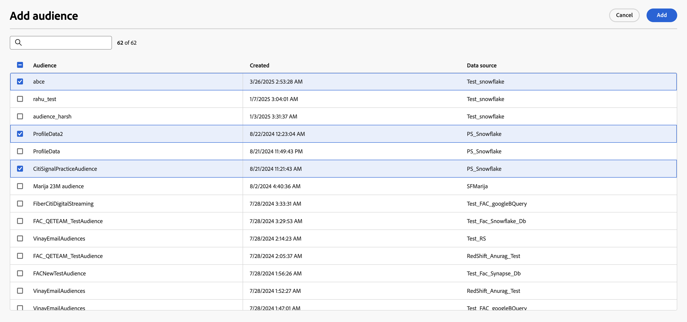{zoomable="yes"}

5. Establish connections between tables in your data model to ensure accurate data relationships. For more information, read the [create links section](#data-model-links).

6. After completing the configuration, select **[!UICONTROL Save]** to apply your changes.

## Create links {#data-model-links}

>[!NOTE]
>
>If you're creating a link with multiple joins, you can only use the same combination of source and target schemas once.

>[!BEGINTABS]

>[!TAB Table view]

To create links between tables of your data model from the table view tab, follow these steps: 

1. Select the  followed by **[!UICONTROL Create link]** next to one of the table, or select **[!UICONTROL Create links]** within the **[!UICONTROL Links]** section:

    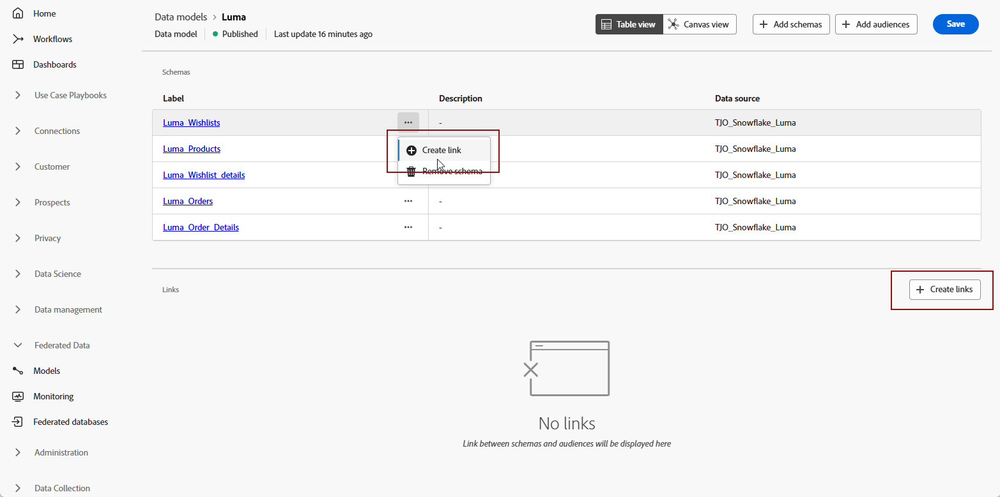{zoomable="yes"}

2. Fill in the given form to define the link.

    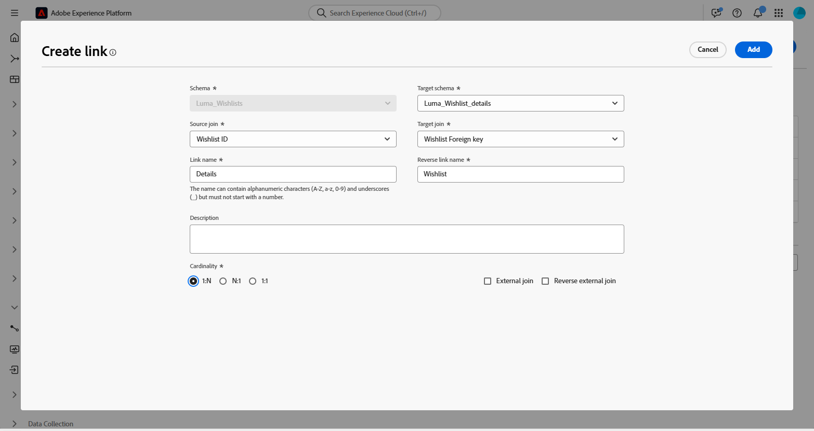{zoomable="yes"}

    **Cardinality**

     * **1-N**: one occurrence of the source table can have several corresponding occurrences of the target table, but one occurrence of the target table can have at most one corresponding occurrence of the source table.

     * **N-1**: one occurrence of the target table can have several corresponding occurrences of the source table, but one occurrence of the source table can have at most one corresponding occurrence of the target table.
     
     * **1-1**: one occurrence of the source table can have at most one corresponding occurrence of the target table.
  
    To create a multiple join link, select the plus icon. You can now create multiple joins between the schema fields.

    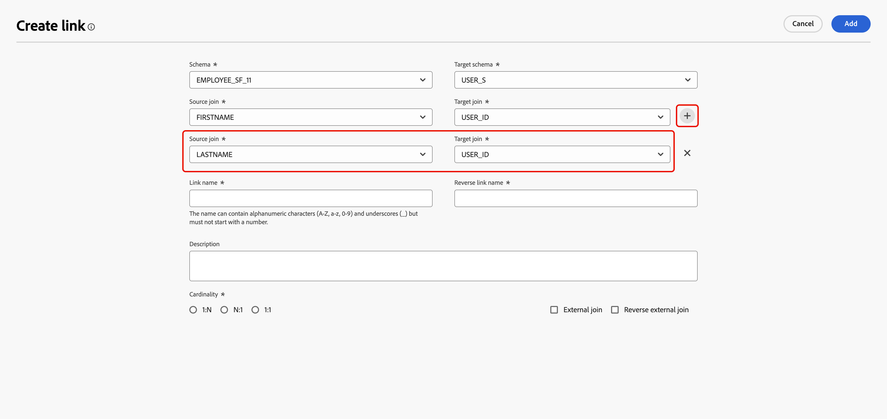{zoomable="yes"}

All the links defined for your data model are listed as below:

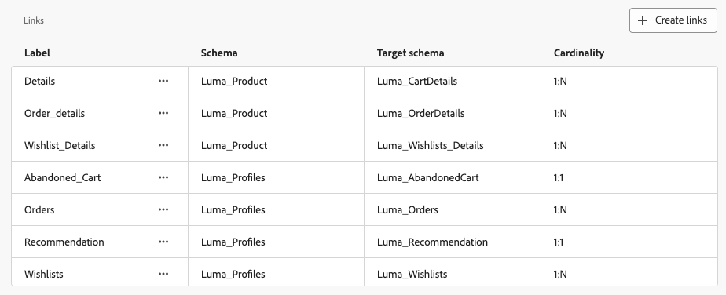{zoomable="yes"}

>[!TAB Canvas view]

To create links between tables of your data model from the Canvas view tab, follow these steps: 

1. Access the Canvas view of your data model and choose the two tables you want to link

2. Select the  button next to the Source Join, then drag and guide the arrow towards the Target Join to establish the connection.

    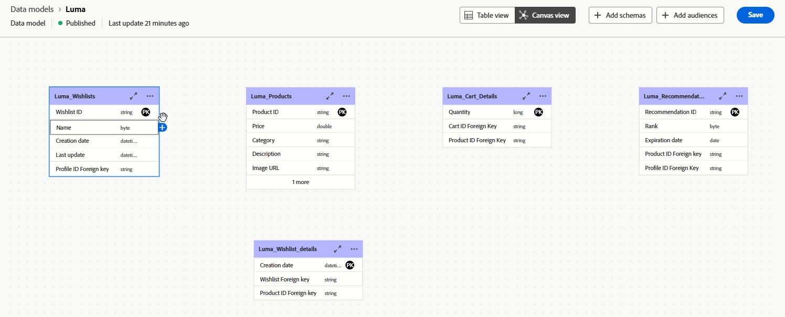{zoomable="yes"}

3. Fill in the given form to define the link and select **[!UICONTROL Apply]** once configured.

    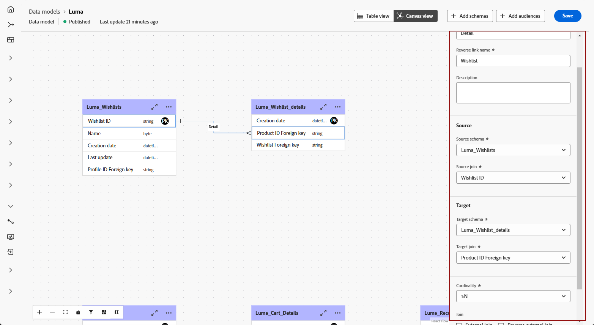{zoomable="yes"}

    **Cardinality**

     * **1-N**: one occurrence of the source table can have several corresponding occurrences of the target table, but one occurrence of the target table can have at most one corresponding occurrence of the source table.

     * **N-1**: one occurrence of the target table can have several corresponding occurrences of the source table, but one occurrence of the source table can have at most one corresponding occurrence of the target table.
     
     * **1-1**: one occurrence of the source table can have at most one corresponding occurrence of the target table.

4. All links defined in your data model are represented as arrows in the canvas view. Select an arrow between two tables to view details, make edits, or remove the link as needed.

    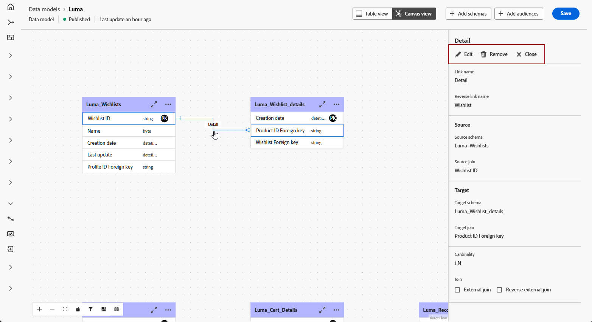{zoomable="yes"}

5. Use the toolbar to customize and adjust your canvas.

    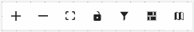

    * **[!UICONTROL Zoom in]**: Magnify the canvas to see details of your data model more clearly.
    * **[!UICONTROL Zoom out]**: Reduce the canvas size for a broader view of your data model.
    * **[!UICONTROL Fit view]**: Adjust the zoom to fit all schemas and/or audiences within the visible area.
    * **[!UICONTROL Toggle interactivity]**: Enable or disable user interaction with the canvas.
    * **[!UICONTROL Filter]**: Choose which schema to display within the canvas.
    * **[!UICONTROL Force auto layout]**: Automatically arrange schemas and/or audiences for better organization.

>[!ENDTABS]

## How to video {#data-model-video}

Learn how to create a data model in this video:

>[!VIDEO](https://video.tv.adobe.com/v/3432020)
