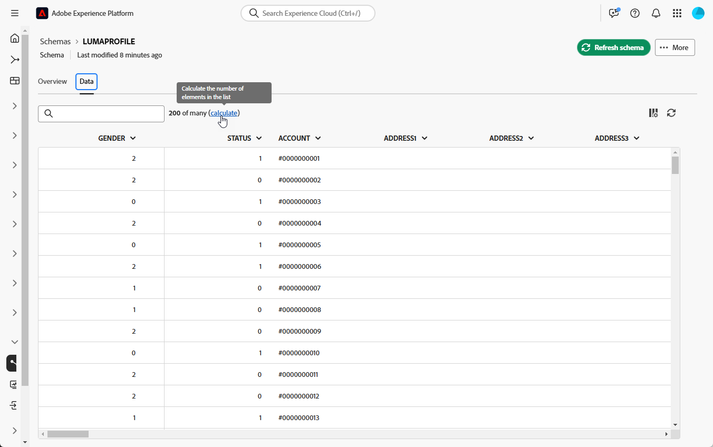
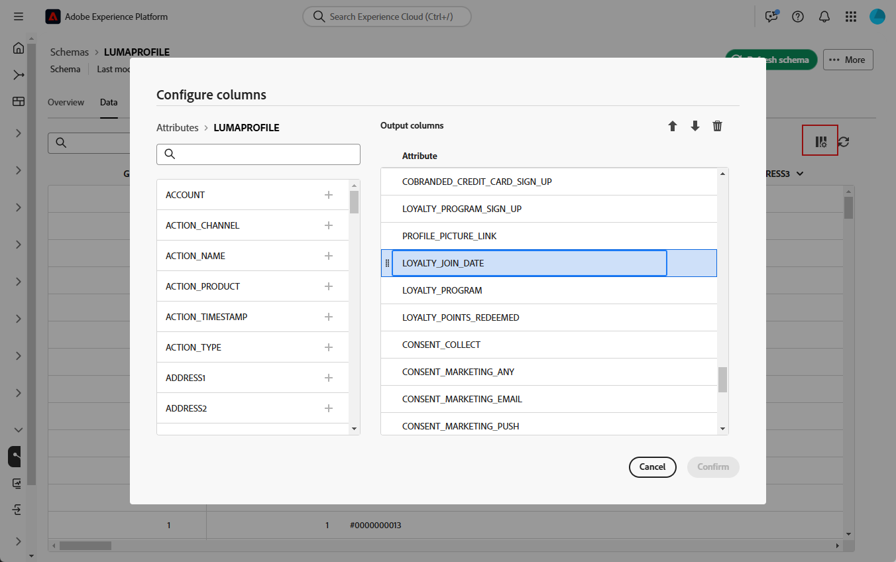
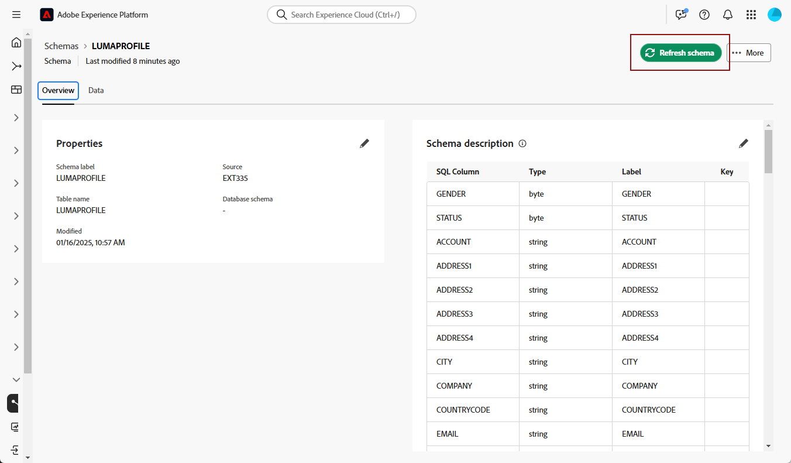
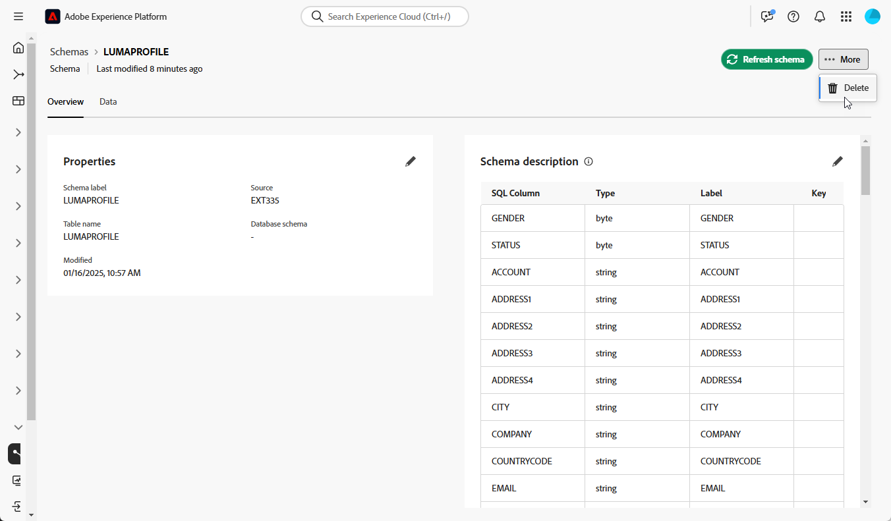

# Schemas overview {#schemas}

>[!AVAILABILITY]
>
>To access schemas, you'll need one of the following permissions:
>
>-**Manage Federated Schema**
>-**View Federated Schema**
>
>For more information on the required permissions, please read the [access control guide](/help/governance-privacy-security/access-control.md).

A schema is a representation of a table of your database. It is an object within the application that defines how the data are tied to database tables. 

By creating a schema, you can define a representation of your table in Experience Platform Federated Audience Composition: 

* Give it a friendly name and description to simplify the comprehension for the user
* Decide the visibility of each field, according to their real use 
* Select its primary key, in order to link schemas between them, as needed in the [data model](../data-modelling/models.md#data-model-start)

>[!CAUTION]
>
>When connecting multiple sandboxes with same database, you must use distinct working schemas.

## Create a schema {#create}

>[!CONTEXTUALHELP]
>id="platform_schemas_manageconfiguration"
>title="Manage configuration"
>abstract="Temporary blank content."

To create a schema in Federated Audience Composition, select **[!UICONTROL Schemas]** within the **[!UICONTROL Data Management]** section of the Experience Platform UI. Within the Schemas UI, select **[!UICONTROL Create schema]**.

Once the Create schema popover appears, select **[!UICONTROL Relational]**, followed by **[!UICONTROL Discover schemas]** and **[!UICONTROL Next]** to create a schema for Federated Audience Composition.

The **[!UICONTROL Select federated database]** popover appears. On this popover, you can select the [source database](/help/connections/home.md), followed by **[!UICONTROL Next]**.

## Define schema {#define}

After choosing the federated database, you can now define your schema. The **[!UICONTROL Add data]** screen appears. On this page, you can select **[!UICONTROL Add table]** to choose which tables you want to add to the schema.

The **[!UICONTROL Select Table]** popover appears. On this popover, you can select the tables which you want to use to create the schema.

{zoomable="yes"}

Each selected table generates a schema with the chosen columns. For each table, you can change the label of the schema, add a description, rename the field label, set the field label visibility, and select the schema primary key.

{zoomable="yes"}

>[!NOTE]
>
>If you choose **[!UICONTROL Composite Key]** but only select one key to be used, the key will be treated like a standard schema primary key.

Additionally, you can create a key that is made up of multiple schema columns. Select **[!UICONTROL Composite Key]**, and mark the keys you want to use as your composite key.

{zoomable="yes"}

After completing your configuration, select **[!UICONTROL Done]** to finish creating your schema. 

## Edit a schema {#schema-edit}

To edit a schema, select the  next to your previously created schema on the **Schemas** page, followed by **[!UICONTROL Edit]**.

On the **[!UICONTROL Edit schema]** window, you can see the Schema Editor. For more information on using the Schema Editor, read the [schema UI guide](https://experienceleague.adobe.com/en/docs/experience-platform/xdm/ui/resources/schemas#customize-schema).

## Preview data in a schema {#schema-preview}

I DO NOT SEE THIS IN THE INTEGRATED SYSTEM

To preview the data in the table represented by your schema, browse to the **[!UICONTROL Data]** tab as below.

Select **[!UICONTROL Calculate]** link to preview the total number of recordings.

{zoomable="yes"}

Select the **[!UICONTROL Configure columns]** button to change the data display.

{zoomable="yes"}

## Refresh a schema {#schema-refresh}

I DO NOT SEE THIS IN THE INTEGRATED SYSTEM

Tables in a federated database can be updated, added or removed. In such cases, you must refresh the schema in Adobe Experience Platform to align with the latest changes. To perform this, select the  next to the name of the schema followed by **[!UICONTROL Refresh schema]**. 

You can also update the schema definition when editing it.

{zoomable="yes"}

## Delete a schema {#schema-delete}

To delete a schema, select the , followed by **[!UICONTROL Delete]**.

{zoomable="yes"}
