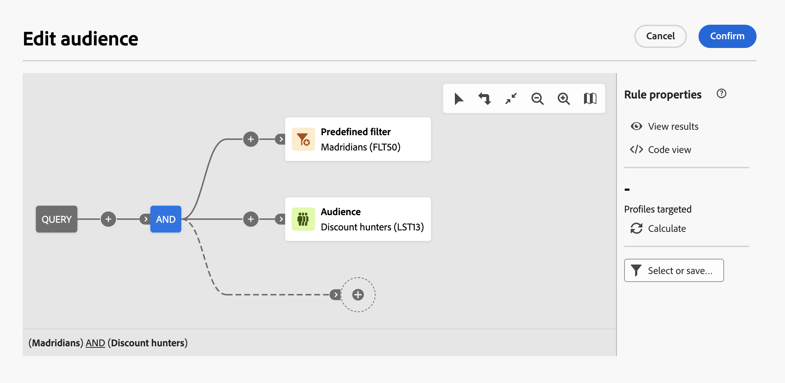
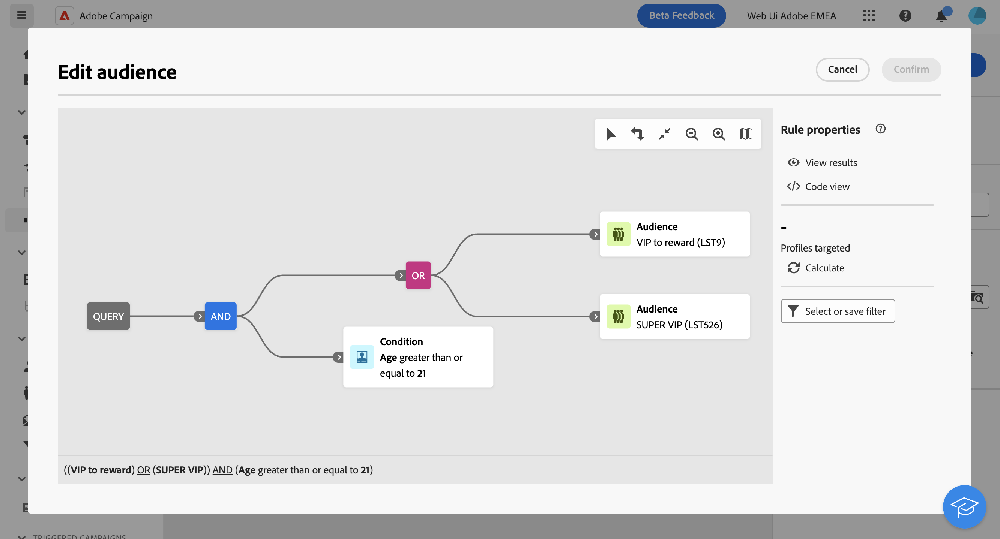

# Build your first query {#build-query}

To start building a query, access the query modeler from the location of your choice, depending on the action you want to perform. The Query modeler opens with a blank canvas. Click the **+** button to configure the first node of your query.

You can add two types of elements:  

* **Filtering components** (Custom condition, Select audience) allow you to build your own rules or select an audience to refine your query. They are added at the start of your query and on dotted transitions. [Learn how to work with filtering components](#filtering)

    Example: *Recipients who subscribed to the 'Sports' newsletter*. *Recipients living in New York*, *Recipients living in San Francisco*

    {zoomable="yes"}

* **Group operators** (AND, OR, EXCEPT) allow you to group together filtering components in the diagram. They are added on existing transitions before a filtering component. [Learn how to work with operators](#filtering)
    
    Example: *Recipients who subscribed to the "Sports" newsletter **AND** who live in New York **OR** San Francisco*.

    {zoomable="yes"}

## Add filtering components {#filtering}

Filtering components allow you to refine your query by using:

* **[Custom conditions](#custom-condition)**: Filter your query by building your own condition with attributes from the database and advanced expressions.
* **[Audiences](#audiences)**: Filter your query using an existing audience.

### Configure a custom condition {#custom-condition}

>[!CONTEXTUALHELP]
>id="dc_orchestration_querymodeler_customcondition"
>title="Custom condition"
>abstract="Custom conditions are filtering components that allow you to filter your query by building your own condition with attributes from the database and advanced expressions."

To filter your query using a custom condition, follow these steps:

1. Click the **+** button on the desired node and select **[!UICONTROL Custom condition]**. The custom condition properties pane opens on the right hand side. 

1. In the **Attribute** field, select the attribute from the database that you want to leverage to create your condtion. The attributes list includes all the attributes from your database, including attributes from linked tables.

    {zoomable="yes"}

    >[!NOTE]
    >
    >The **Edit expression** button allows you to leverage the expression editor to manually define an expression using fields from the database and helper functions. [Learn how to edit expressions](expression-editor.md)

1. Select the operator to apply from the drop-down list. Various operators are available for use. Note that operators available in the drop-down list depend on the attribute's data type. 

   +++List of available operators

    |Operator|Purpose|Example|
    |  ---  |  ---  |  ---  |
    |Equal to| Returns a result identical to the data entered in the second Value column.|Last name (@lastName) equal to 'Jones', will return only recipients whose last name is Jones.|
    |Not equal to|Returns all values not identical to the value entered.|Language (@language) to equal to 'English'|
    |Greater than|Returns a value greater than the value entered.|Age (@age) greater than 50</strong>, will return all values greater than '50', i.e. '51', '52', etc.|
    |Less than|Returns a value smaller than the value entered.|Creation date (@created) before 'DaysAgo(100)'</strong>, will return all recipients created less than 100 days ago.|
    |Greater than or equal to|Returns all values equal to or greater than the value entered.|Age (@age) greater than or equal to '30'</strong>, will return all recipients aged 30 or more.|
    |Less than or equal to|Returns all values equal to or lower than the value entered.|Age (@age) less than or equal to '60'</strong>, will return all recipients aged 60 or less.|
    |Included in|Returns results included in the values indicated. These values have to be separated by a comma.|Birth date (@birthDate) is included in '12/10/1979,12/10/1984', will return the recipients born between these dates.|
    |Not in|Works like the Is included in operator. Here, we want to exclude recipients based on the values entered.|Birth date (@birthDate) is not included in '12/10/1979,12/10/1984'. Unlike in the previous example, recipients born within these dates will not be returned.|
    |Is empty|In this case, the result we are looking for matches an empty value in the second Value column.|Mobile (@mobilePhone) is empty returns all recipients who do not have a mobile number.|
    |Is not empty|Works in reverse to the Is empty operator. It is not necessary to enter data in the second Value column.|Email (@email) is not empty.|
    |Starts with|Returns the results starting with the value entered.|Account # (@account) starts with '32010'.|
    |Does not start with|Returns the results not starting with the value entered|Account # (@account) does not start with '20'|
    |Contains|Returns the results containing at least the value entered.|Email domain (@domain) contains 'mail'</strong>, will return all domain names that contain 'mail'. So the 'gmail.com' domain will also be returned.|
    |Does not contain|Returns results not containing the value entered.|Email domain (@domain) does not contain 'vo'</strong>. In this case, domain names which contain 'vo' will not be returned. The 'voila.fr' domain name will not appear in the results.|
    |Like|Like is very similar to the Contains operator. It lets you insert a % wild card character in the value.|Last name (@lastName) like 'Jon%s'. Here, the wild card character is used as a "joker" to find the name "Jones", should the operator have forgotten the missing letter between the 'n' and the 's'.|
    |Not like|Like is very similar to the Contains operator. It lets you insert a % wild card character in the value.|Last name (@lastName) not like 'Smi%h'. Here, the recipients whose last name is 'Smi%h' will not be returned.|

    +++

1. In the **Value** field, define the expected value. You can also leverage the expression editor to manually define an expression using fields from the database and helper functions. To do this, click the **Edit expression** button. [Learn how to edit expressions](expression-editor.md)

    *Query example returning all profiles aged 21 or more:*

    {zoomable="yes"}

#### Custom conditions on linked tables (1-1 and 1-N links){#links}

Custom conditions allows you to query tables linked to the table currently used by your rule. This includes tables with a 1-1 cardinality link, or collection tables (1-N link).

For a **1-1 link**, navigate to the linked table, select the desired attribute and define the expected value.

You can also directly select a table link in the **Value** picker and confirm. In that case, values available for the selected table need to be selected using a dedicated picker, as shown in the example below.

+++Query example

Here, the query is targeting brands whose label is "running". 

1. Navigate inside the **Brand** table and select the **Label** attribute.

    {zoomable="yes"}{width="85%" align="center"}

1. Define the expected value for the attribute.

    {zoomable="yes"}{width="85%" align="center"}

Here is a query sample where a table link has been selected directly. Available values for this table must be selected from a dedicated picker.

{zoomable="yes"}{width="85%" align="center"}

+++ 

For a **1-N link**, you can define sub-conditions to refine your query, as shown in the example below.

+++Query example

Here, the query is targeting recipients who made purchases related to the BrewMaster product, for a total amount of at least 100$.

1. Select the **Purchases** table and confirm.

    {zoomable="yes"}{width="50%" align="center"}

1. An outbound transition is added, allowing you to create sub-conditions.

    {zoomable="yes"}{width="85%" align="center"}

1. Select the **Price** attribute and target purchases of 1000$ or more

    {zoomable="yes"}{width="85%" align="center"}

1. Add sub-conditions to suit your needs. Here we have added a condition to target profiles who purchased a BrewMaster product.

    {zoomable="yes"}{width="85%" align="center"}

+++ 

#### Work with aggregate data {#aggregate}

Custom conditions allow you to perform aggregate operations. To do this, you need to directly select an attribute from a collection table:

1. Navigate inside the desired collection table and select the attribute on which you want to perform an aggregate operation.

    {zoomable="yes"}{width="85%" align="center"}

1. In the properties pane, toggle on the **Aggregate data** option and select the desired aggregate function.

    {zoomable="yes"}{width="85%" align="center"}

### Select an audience {#audiences}

>[!CONTEXTUALHELP]
>id="dc_orchestration_querymodeler_selectaudience"
>title="Select audience"
>abstract="By using the **Select audience** option, you can choose the audience that you want to use to filter your query."

To filter your query using an existing audience, follow these steps:

1. Click the **+** button on the desired node and choose **[!UICONTROL Select audience]**.

1. The **Select audience** properties pane opens on the right hand side. Choose the audience that you want to use to filter your query.

    *Query example returning all profiles belonging to the "Festival Goers" audience":*

    {zoomable="yes"}

### Use a predefined filter {#predefined-filters}

>[!CONTEXTUALHELP]
>id="dc_orchestration_querymodeler_predefinedfilter"
>title="Predefined filter"
>abstract="By using the **Predefined filter** option, you can select a predefined filter from the list of custom filters or from favorites."

To filter your query using a predefined filter, follow these steps:

1. Click the **+** button on the desired node and select **[!UICONTROL Predefined filter]**.

1. The **Predefined filter** properties pane opens on the right hand side. Select a predefined filter from the list of custom filters or from favorites.

    *Query example returning all profiles corresponding to the "Inactive customers" predefined filter:*

    {zoomable="yes"}

### Copy-paste components {#copy}

The query modeler allows you to copy one or multiple filtering components and paste them at the end of a transition. This operation can be executed within the current query canvas, or in any canvas within your instance.

>[!NOTE]
>
>The copied selection is kept as long as you are working in your instance. If you log off and log back in, your selection will no longer be available for pasting.

To copy-paste filtering components, follow these steps:

1. Select the filtering component that you want to copy by clicking on it in the query canvas. To select multiple components, use the multiple selection tool available in the toolbar located at the upper-right corner of the canvas.

1. Click the **[!UICONTROL Copy]** button in the component's properties pane or in the blue ribbon at the bottom of the screen if you have selected multiple components.

    |Copy a single component|Copy multiple components|
    |  ---  |  ---  |
    |{zoomable="yes"}{width="200" align="center" zoomable="yes"}|{zoomable="yes"}{width="200" align="center" zoomable="yes"}|

1. To paste the component(s), click the + button at the end of the desired transition and select **Paste n items**.

    {zoomable="yes"}

## Combine filtering components with operators {#operators}

>[!CONTEXTUALHELP]
>id="dc_orchestration_querymodeler_group"
>title="Group"
>abstract="In this pane, you can change the operator used to link filtering conditions together."

Each time you add a new filtering component to your query, it is automatically linked to the other component by an **AND** operator. This means that results from the two filtering components are combined.

In this example, we have added a new audience-type filtering components on the second transition. The component is linked to the predefined filter condition with an **AND** operator, meaning that the query results include recipients targeted by the "Madridians" predefined filter AND belonging to the "Discount hunters" audience.

{zoomable="yes"}

To change the operator used to link filtering conditions together, click on it and select the desired operator in the **Group** pane that opens on the right hand side.

Available operators are:

* **AND (Intersection)**: Combines results matching all the filtering components in the outbound transitions. 
* **OR (Union)**: Includes results matching at least one of the filtering components in the outbound transitions.
* **EXCEPT (Exclusion)**: Excludes results matching all the filtering componentns in the outbound transition. 

{zoomable="yes"}

In addition, you can create intermediate groups of components by clicking the **+** button on a transition. This allows you to add an operator at this specific location to group together multiple components and refine your query. 

In the example below, we have created an intermediate group to include results from either the "VIP to reward" or "Super VIP" audiences.

{zoomable="yes"}

## Check and validate your query

>[!CONTEXTUALHELP]
>id="dc_orchestration_querymodeler_ruleproperties"
>title="Rule properties"
>abstract="Once you've built your query in the canvas, you can check it using the **Rule properties** pane located on the right hand side. This pane allows you to display the resulting data, to retrieve an SQL code version of the query, and check the number of targeted records. Use the **Select or save filter** button to save your query as a predefined filter, or replace the canvas content with an existing filter."

Once you've built your query in the canvas, you can check it using the **Rule properties** pane located on the right hand side. This pane displays when building a query to create an audience. Available operations are:

* **View results:** Displays the data resulting from your query.
* **Code view**: Displays a code-based version of the query in SQL.
* **Calculate**: Updates and displays the number of records targeted by your query.
* **Select or save filter**: Choose an existing predefined filter to use in the canvas, or save your query as a predefined filter for future reuse.

    >[!IMPORTANT]
    >
    >Select a predefined filter from the Rule properties pane replaces the query that has been built in the canvas with the selected filter.

When your query is ready, click the **[!UICONTROL Confirm]** button in the upper-right corner to save it.

You can modify your query at any time by opening it. Keep in mind that upon opening an existing query, it displays in a simplified view without the visiblity of  **+** buttons. To add new elements to the query, select a component or operator on the canvas to display the **+** buttons.

{zoomable="yes"}
