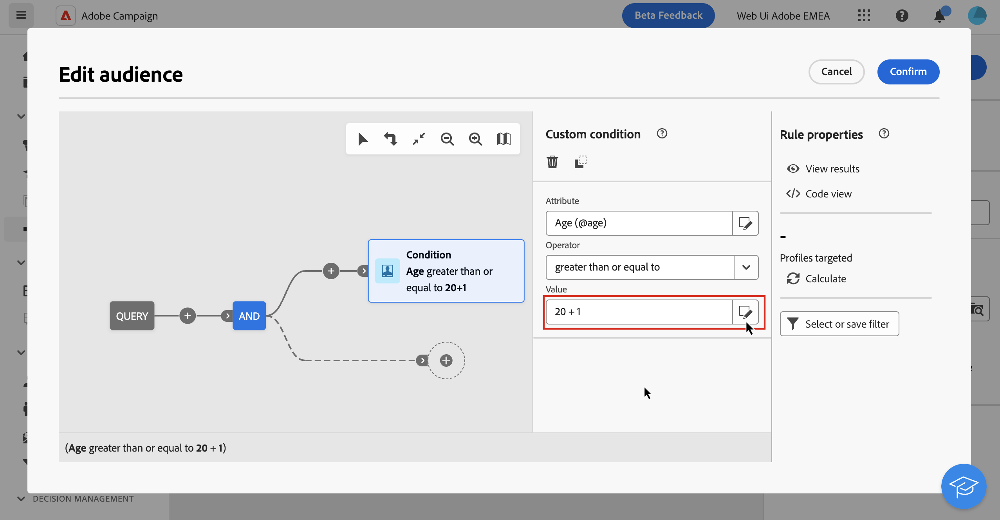

# Edit expressions {#expression}

Editing an expression involves manually entering conditions to form a rule. This mode allows you to use advanced functions, which let you manipulate the values used to carry out specific queries such as manipulating dates, strings, numerical fields, sorting, etc.

>[!IMPORTANT]
>
>The section below provides information on how to work with the expression editor to build rules. Keep in mind that the syntax used to build rules differ from the one used to add personalization.

## Work with the expression editor {#edit}

The expression editor is available from the query modeler **[!UICONTROL Edit expression]** button, available for the **[!UICONTROL Attribute]** and **[!UICONTROL Value]** fields when configuring a custom condition. 

|Access from the **[!UICONTROL Attribute]** field|Access from the **[!UICONTROL Value]** field|
|  ---  |  ---  |
|{zoomable="yes"}{width="200" align="center" zoomable="yes"}|{zoomable="yes"}{width="200" align="center" zoomable="yes"}|

The expression editor provides:

* An **input field (1)** in which the expression is defined.
* The list of available **fields (2)** that can be used in the expression and corresponding to the schema, also known as targeting dimension, of the query.
* **Helper functions (3)**, sorted by category.

Edit the expression by entering an expression directly in the input field. To add a field or a helper function, place your cursor in the expression where you want to add it and click the + button.

{zoomable="yes"}

When your expression is ready, click the **[!UICONTROL Confirm]** button. The expression displays in the selected field. To edit it, open the expression editor and make the desired changes.

The example below shows an expression configured for the **[!UICONTROL Value]** field. To edit it, you need to open the expression editor using the **[!UICONTROL Edit expression]** button.

{zoomable="yes"}

## Helper functions

The query editing tool allows you to use advanced functions to carry out complex filtering depending on the desired results and the types of manipulated data. The following functions are available:

### Aggregate

The aggregate functions are used to perform calculations on a set of values.

<table> 
 <tbody> 
  <tr> 
   <td> <strong>Name</strong>  </td> 
   <td> <strong>Description</strong>  </td> 
   <td> <strong>Syntax</strong>  </td> 
  </tr> 
  <tr> 
   <td> <strong>Avg</strong>  </td> 
   <td> Returns the average of a number type column  </td> 
   <td> Avg(&lt;value&gt;) </td> 
  </tr> 
  <tr> 
   <td> <strong>Count</strong>  </td> 
   <td> Counts the non-null values of a column  </td> 
   <td> Count(&lt;value&gt;) </td>  
  </tr> 
  <tr> 
   <td> <strong>CountAll</strong>  </td> 
   <td> Counts the values returned (all fields)  </td> 
   <td> CountAll()  </td> 
  </tr> 
  <tr> 
   <td> <strong>Countdistinct</strong>  </td> 
   <td> Counts the distinct non-null values of a column  </td> 
   <td> Countdistinct(&lt;value&gt;) </td> 
  </tr> 
  <tr> 
   <td> <strong>Max</strong>  </td> 
   <td> Returns the maximum value of a number, string, or date type column  </td> 
   <td> Max(&lt;value&gt;) </td>  
  </tr> 
  <tr> 
   <td> <strong>Min</strong>  </td> 
   <td> Returns the minimum value of a number, string or date type column  </td> 
   <td> Min(&lt;value&gt;) </td> 
  </tr> 
  <tr> 
   <td> <strong>StdDev</strong>  </td> 
   <td> Returns the standard deviation of a number, string or date column  </td> 
   <td> StdDev(&lt;value&gt;) </td> 
  </tr>
  <tr> 
   <td> <strong>StringAgg</strong>  </td> 
   <td> Returns the concatenation of the values of a string type column, separated by the character in the second argument  </td> 
   <td> StringAgg(&lt;Value&gt;, &lt;String&gt;) </td> 
  </tr> 
  <tr> 
   <td> <strong>Sum</strong>  </td> 
   <td> Returns the sum of the values of a number, string, or date type column  </td> 
   <td> Sum(&lt;value&gt;) </td> 
  </tr> 
 </tbody> 
</table>

### Date

The date functions are used to manipulate date or time values. 

<table> 
 <tbody> 
  <tr> 
   <td> <strong>Name</strong>  </td> 
   <td> <strong>Description</strong>  </td> 
   <td> <strong>Syntax</strong>  </td> 
  </tr> 
  <tr> 
   <td> <strong>AddDays</strong>  </td> 
   <td> Adds a number of days to a date  </td> 
   <td> AddDays(&lt;date&gt;, &lt;number&gt;)  </td>  
  </tr> 
  <tr> 
   <td> <strong>AddHours</strong>  </td> 
   <td> Adds a number of hours to a date  </td> 
   <td> AddHours(&lt;date&gt;, &lt;number&gt;)  </td>  
  </tr> 
  <tr> 
   <td> <strong>AddMinutes</strong>  </td> 
   <td> Adds a number of minutes to a date  </td> 
   <td> AddMinutes(&lt;date&gt;, &lt;number&gt;)  </td>  
  </tr> 
  <tr> 
   <td> <strong>AddMonths</strong>  </td> 
   <td> Adds a number of months to a date  </td> 
   <td> AddMonths(&lt;date&gt;, &lt;number&gt;)  </td>  
  </tr> 
  <tr> 
   <td> <strong>AddSeconds</strong>  </td> 
   <td> Adds a number of seconds to a date  </td> 
   <td> AddSeconds(&lt;date&gt;, &lt;number&gt;)  </td>  
  </tr> 
  <tr> 
   <td> <strong>AddYears</strong>  </td> 
   <td> Adds a number of years to a date  </td> 
   <td> AddYears(&lt;date&gt;, &lt;number&gt;)  </td>  
  </tr>
  <tr> 
   <td> <strong>ConvertNTZ</strong>  </td> 
   <td> Converts timestamp NTZ (timestamp without timezone) into TZ (timestamp with timezone) applying defined session TZ  </td> 
   <td> ConvertNTZ (&lt;date+time&gt;)  </td>  
  </tr>
  <tr> 
   <!--<td> <strong>ConvertTimezone</strong>  </td> 
   <td>   </td> 
   <td> ConvertNTZ (&lt;date+time&gt;)  </td>  
  </tr>-->
  <tr> 
   <td> <strong>DateCmp</strong>  </td> 
   <td> Compare two dates  </td> 
   <td> DateCmp(&lt;date&gt;,&lt;date&gt;)  </td>  
  </tr>
  <tr> 
   <td> <strong>DateOnly</strong>  </td> 
   <td> Returns the date only (with time at 00:00)*  </td> 
   <td> DateOnly(&lt;date&gt;)  </td>  
  </tr> 
  <tr> 
   <td> <strong>Day</strong>  </td> 
   <td> Returns the number representing the day of the date  </td> 
   <td> Day(&lt;date&gt;)  </td>  
  </tr> 
  <tr> 
   <td> <strong>DayOfYear</strong>  </td> 
   <td> Returns the number of the day in the year of the date  </td> 
   <td> DayOfYear(&lt;date&gt;)  </td>  
  </tr> 
  <tr> 
   <td> <strong>DaysAgo</strong>  </td> 
   <td> Returns the date corresponding to the current date minus n days  </td> 
   <td> DaysAgo(&lt;number&gt;)  </td>  
  </tr> 
  <tr> 
   <td> <strong>DaysAgoInt</strong>  </td> 
   <td> Returns the date (integer yyyymmdd) corresponding to the current date minus n days  </td> 
   <td> DaysAgoInt(&lt;number&gt;)  </td>  
  </tr> 
  <tr> 
   <td> <strong>DaysDiff</strong>  </td> 
   <td> Number of days between two dates  </td> 
   <td> DaysDiff(&lt;end date&gt;, &lt;start date&gt;)  </td>  
  </tr> 
  <tr> 
   <td> <strong>DaysOld</strong>  </td> 
   <td> Returns the age in days of a date  </td> 
   <td> DaysOld(&lt;date&gt;)  </td>  
  </tr> 
  <tr> 
   <td> <strong>GetDate</strong>  </td> 
   <td> Returns the current system date of the server  </td> 
   <td> GetDate()  </td> 
  </tr> 
  <tr> 
   <td> <strong>Hour</strong>  </td> 
   <td> Returns the hour of the date  </td> 
   <td> Hour(&lt;date&gt;)  </td>  
  </tr> 
  <tr> 
   <td> <strong>HoursDiff</strong>  </td> 
   <td> Returns the number of hours between two dates  </td> 
   <td> HoursDiff(&lt;end date&gt;, &lt;start date&gt;)  </td>  
  </tr> 
  <tr> 
   <td> <strong>Minute</strong>  </td> 
   <td> Returns the minutes of the date  </td> 
   <td> Minute(&lt;date&gt;)  </td>  
  </tr> 
  <tr> 
   <td> <strong>MinutesDiff</strong>  </td> 
   <td> Returns the number of minutes between two dates  </td> 
   <td> MinutesDiff(&lt;end date&gt;, &lt;start date&gt;)  </td>  
  </tr> 
  <tr> 
   <td> <strong>Month</strong>  </td> 
   <td> Returns the number representing the month of the date  </td> 
   <td> Month(&lt;date&gt;)  </td>  
  </tr> 
  <tr> 
   <td> <strong>MonthsAgo</strong>  </td> 
   <td> Returns the date corresponding to the current date minus n months  </td> 
   <td> MonthsAgo(&lt;number&gt;)  </td>  
  </tr> 
  <tr> 
   <td> <strong>MonthsDiff</strong>  </td> 
   <td> Returns the number of months between two dates  </td> 
   <td> MonthsDiff(&lt;end date&gt;, &lt;start date&gt;)  </td>  
  </tr> 
  <tr> 
   <td> <strong>MonthsOld</strong>  </td> 
   <td> Returns the age in months of a date  </td> 
   <td> MonthsOld(&lt;date&gt;)  </td>  
  </tr> 
  <tr> 
   <td> <strong>Oldest</strong>  </td> 
   <td> Returns the oldest date in a range  </td> 
   <td> Oldest (&lt;date, date&gt;)  </td>  
  </tr> 
  <tr> 
   <td> <strong>Second</strong>  </td> 
   <td> Returns the seconds of the date  </td> 
   <td> Second(&lt;date&gt;)  </td>  
  </tr> 
  <tr> 
   <td> <strong>SecondsDiff</strong>  </td> 
   <td> Returns the number of seconds between two dates  </td> 
   <td> SecondsDiff(&lt;end date&gt;, &lt;start date&gt;)  </td>  
  </tr> 
  <tr> 
   <td> <strong>SubDays</strong>  </td> 
   <td> Subtracts a number of days from a date  </td> 
   <td> SubDays(&lt;date&gt;, &lt;number&gt;)  </td>  
  </tr> 
  <tr> 
   <td> <strong>SubHours</strong>  </td> 
   <td> Subtracts a number of hours from a date  </td> 
   <td> SubHours(&lt;date&gt;, &lt;number&gt;)  </td>  
  </tr> 
  <tr> 
   <td> <strong>SubMinutes</strong>  </td> 
   <td> Subtracts a number of minutes from a date  </td> 
   <td> SubMinutes(&lt;date&gt;, &lt;number&gt;)  </td>  
  </tr> 
  <tr> 
   <td> <strong>SubMonths</strong>  </td> 
   <td> Subtracts a number of months from a date  </td> 
   <td> SubMonths(&lt;date&gt;, &lt;number&gt;)  </td>  
  </tr> 
  <tr> 
   <td> <strong>SubSeconds</strong>  </td> 
   <td> Subtracts a number of seconds from a date  </td> 
   <td> SubSeconds(&lt;date&gt;, &lt;number&gt;)  </td>  
  </tr> 
  <tr> 
   <td> <strong>SubYears</strong>  </td> 
   <td> Subtracts a number of years from a date  </td> 
   <td> SubYears(&lt;date&gt;, &lt;number&gt;)  </td>  
  </tr> 
  <tr> 
   <td> <strong>ToDate</strong>  </td> 
   <td> Converts a date + time as a date  </td> 
   <td> ToDate(&lt;date + time&gt;)  </td>  
  </tr> 
  <tr> 
   <td> <strong>ToDateTime</strong>  </td> 
   <td> Converts a string to a date + time  </td> 
   <td> ToDateTime(&lt;string&gt;)  </td>  
  </tr> 
  <tr> 
   <td> <strong>ToTimestamp</strong>  </td> 
   <td> Converts a string to a timestamp  </td> 
   <td> ToTimestamp(&lt;string&gt;)  </td>  
  </tr> 
  <tr> 
   <td> <strong>ToTimeZone</strong>  </td> 
   <td> Convert a date + time to time zone  </td> 
   <td> ToTimeZone(&lt;date&gt;,&lt;time zone&gt;)  </td>  
  </tr> 
  <tr> 
   <td> <strong>TruncDate</strong>  </td> 
   <td> Rounds a date+time to the nearest second  </td> 
   <td> TruncDate(@lastModified, &lt;number of seconds&gt;)  </td> 
  </tr> 
  <tr> 
   <td> <strong>TruncDateTZ</strong>  </td> 
   <td> Rounds a date + time to a given precision expressed in seconds  </td> 
   <td> TruncDateTZ(&lt;date&gt;, &lt;number of seconds&gt;, &lt;time zone&gt;)  </td> 
  </tr> 
  <tr> 
   <td> <strong>TruncQuarter</strong>  </td> 
   <td> Rounds a date off to the quarter  </td> 
   <td> TruncQuarter(&lt;date&gt;)  </td>  
  </tr> 
  <tr> 
   <td> <strong>TruncTime</strong>  </td> 
   <td> Rounds the time part up to the nearest second  </td> 
   <td> TruncTim(e&lt;date&gt;, &lt;number of seconds&gt;)  </td>  
  </tr> 
  <tr> 
   <td> <strong>TruncWeek</strong>  </td> 
   <td> Rounds a date off to the week  </td> 
   <td> TruncWeek(&lt;date&gt;)  </td>  
  </tr> 
  <tr> 
   <td> <strong>TruncYear</strong>  </td> 
   <td> Rounds a date + time to January 1st of the year  </td> 
   <td> TruncYear(&lt;date&gt;)  </td>  
  </tr> 
  <tr> 
   <td> <strong>WeekDay</strong>  </td> 
   <td> Returns a number representing the day in the week of the date (0=Monday, 6=Sunday)  </td> 
   <td> WeekDay(&lt;date&gt;)  </td>  
  </tr> 
  <tr> 
   <td> <strong>Year</strong>  </td> 
   <td> Returns the number representing the year of the date  </td> 
   <td> Year(&lt;date&gt;)  </td>  
  </tr> 
  <tr> 
   <td> <strong>YearAnd Month</strong>  </td> 
   <td> Returns the number representing the year and month of the date  </td> 
   <td> YearAndMonth(&lt;date&gt;)  </td>  
  </tr>
  <tr> 
   <td> <strong>YearsAgo</strong>  </td> 
   <td> Returns the number of years between a given date and the current date  </td> 
   <td> YearsAgo(&lt;date&gt;)  </td>  
  </tr> 
  <tr> 
   <td> <strong>YearsDiff</strong>  </td> 
   <td> Returns the number of years between the two dates  </td> 
   <td> YearsDiff(&lt;end date&gt;, &lt;start date&gt;)  </td>  
  </tr> 
  <tr> 
   <td> <strong>YearsOld</strong>  </td> 
   <td> Returns the age in years of a date  </td> 
   <td> YearsOld(&lt;date&gt;)  </td>  
  </tr> 
 </tbody> 
</table>

>[!NOTE]
>
>Note that the **Dateonly** function takes into account the server's timezone, not the operator's.

### Geomarketing

The geomarketing functions are used to manipulate geographical values. 

<table> 
 <tbody> 
  <tr> 
   <td> <strong>Name</strong>  </td> 
   <td> <strong>Description</strong>  </td> 
   <td> <strong>Syntax</strong>  </td> 
  </tr> 
  <tr> 
   <td> <strong>Distance</strong>  </td> 
   <td> Returns the distance between two points defined by their longitude and latitude, expressed in degrees.  </td> 
   <td> Distance(&lt;Longitude A&gt;, &lt;Latitude A&gt;, &lt;Longitude B&gt;, &lt;Latitude B&gt;)  </td>  
  </tr> 
 </tbody> 
</table>

### Numeric

The numeric functions are used to convert text to numbers. 

<table> 
 <tbody> 
  <tr> 
   <td> <strong>Name</strong>  </td> 
   <td> <strong>Description</strong>  </td> 
   <td> <strong>Syntax</strong>  </td> 
  </tr> 
  <tr> 
   <td> <strong>Abs</strong>  </td> 
   <td> Returns the absolute value of a number  </td> 
   <td> Abs(&lt;number&gt;)  </td>  
  </tr> 
  <tr> 
   <td> <strong>Ceil</strong>  </td> 
   <td> Returns the lowest integer greater than or equal to a number  </td> 
   <td> Ceil(&lt;number&gt;)  </td>  
  </tr> 
  <tr> 
   <td> <strong>Floor</strong>  </td> 
   <td> Returns the greatest integer greater than or equal to a number  </td> 
   <td> Floor(&lt;number&gt;)  </td>  
  </tr> 
  <tr> 
   <td> <strong>Greatest</strong>  </td> 
   <td> Returns the greater of two numbers  </td> 
   <td> Greatest(&lt;number 1&gt;, &lt;number 2&gt;)  </td>  
  </tr> 
  <tr> 
   <td> <strong>Least</strong>  </td> 
   <td> Returns the smaller of two numbers  </td> 
   <td> Least(&lt;number 1&gt;, &lt;number 2&gt;)  </td>  
  </tr> 
  <tr> 
   <td> <strong>Mod</strong>  </td> 
   <td> Returns the remainder of the integer division of n1 by n2  </td> 
   <td> Mod(&lt;number 1&gt;, &lt;number 2&gt;)  </td>  
  </tr> 
  <tr> 
   <td> <strong>Percent</strong>  </td> 
   <td> Returns the ratio of two numbers expressed as a percentage  </td> 
   <td> Percent(&lt;number 1&gt;, &lt;number 2&gt;)  </td>  
  </tr> 
  <tr> 
   <td> <strong>Random</strong>  </td> 
   <td> Returns the random value  </td> 
   <td> Random()  </td> 
  </tr> 
  <tr> 
   <td> <strong>Round</strong>  </td> 
   <td> Rounds off a number to n decimals  </td> 
   <td> Round(&lt;number&gt;, &lt;number of decimals&gt;)  </td>  
  </tr> 
  <tr> 
   <td> <strong>Sign</strong>  </td> 
   <td> Returns the sign of the number  </td> 
   <td> Sign(&lt;number&gt;)  </td>  
  </tr> 
  <tr> 
   <td> <strong>ToDouble</strong>  </td> 
   <td> Converts an integer to a float  </td> 
   <td> ToDouble(&lt;number&gt;)  </td>  
  </tr> 
  <tr> 
   <td> <strong>ToInt64</strong>  </td> 
   <td> Converts a float to a 64 bit integer  </td> 
   <td> ToInt64(&lt;number&gt;)  </td>  
  </tr> 
  <tr> 
   <td> <strong>ToInteger</strong>  </td> 
   <td> Converts a float to an integer  </td> 
   <td> ToInteger(&lt;number&gt;)  </td>  
  </tr> 
  <tr> 
   <td> <strong>Trunc</strong>  </td> 
   <td> Truncates n1 to n2 decimals  </td> 
   <td> Trunc(&lt;n1&gt;, &lt;n2&gt;)  </td>  
  </tr> 
 </tbody> 
</table>

### Others

This table contains the remaining functions available. 

<table> 
 <tbody> 
  <tr> 
   <td> <strong>Name</strong>  </td> 
   <td> <strong>Description</strong>  </td> 
   <td> <strong>Syntax</strong>  </td> 
  </tr> 
  <tr> 
   <td> <strong>AESEncrypt</strong>  </td> 
   <td> Encrypt string provided in argument  </td> 
   <td> AESEncrypt(&lt;value&gt;)  </td> 
  </tr>
  <tr> 
   <td> <strong>Case</strong>  </td> 
   <td> Returns value 1 if the condition is true. If not, it returns value 2.  </td> 
   <td> Case(When(&lt;condition&gt;, &lt;value 1&gt;), Else(&lt;value 2&gt;))  </td> 
  </tr> 
  <tr> 
   <td> <strong>ClearBit</strong>  </td> 
   <td> Deletes the Flag in the value  </td> 
   <td> ClearBit(&lt;identifier&gt;, &lt;flag&gt;)  </td>  
  </tr> 
  <tr> 
   <td> <strong>Coalesce</strong>  </td> 
   <td> Returns value 2 if value 1 is zero or null, otherwise returns value 1  </td> 
   <td> Coalesce(&lt;value 1&gt;, &lt;value 2&gt;)  </td>  
  </tr> 
  <tr> 
   <td> <strong>Decode</strong>  </td> 
   <td> Returns value 3 if value 1 = value 2. If not returns value 4.  </td> 
   <td> Decode(&lt;value 1&gt;, &lt;value 2&gt;, &lt;value 3&gt;, &lt;value 4&gt;)  </td>  
  </tr> 
  <!--<tr> 
   <td> <strong>DefaultFolder</strong>  </td> 
   <td> Returns value 3 if value 1 = value 2. If not returns value 4.  </td> 
   <td> Decode(&lt;value 1&gt;, &lt;value 2&gt;, &lt;value 3&gt;, &lt;value 4&gt;)  </td>  
  </tr> -->
  <tr> 
   <td> <strong>Else</strong>  </td> 
   <td> Returns value 1 (may only be used as a parameter of the case function)  </td> 
   <td> Else(&lt;value 1&gt;, &lt;value 2&gt;)  </td>  
  </tr> 
  <tr> 
   <td> <strong>GetEmailDomain</strong>  </td> 
   <td> Extracts the domain from an email address  </td> 
   <td> GetEmailDomain(&lt;value&gt;)  </td>  
  </tr> 
  <tr> 
   <td> <strong>GetMirrorURL</strong>  </td> 
   <td> Retrieves the URL of the mirror page server  </td> 
   <td> GetMirrorURL(&lt;value&gt;)  </td>  
  </tr> 
  <tr> 
   <td> <strong>Iif</strong>  </td> 
   <td> Returns value 1 if the expression is true. If not, returns value 2  </td> 
   <td> Iif(&lt;condition&gt;, &lt;value 1&gt;, &lt;value 2&gt;)  </td>  
  </tr> 
  <tr> 
   <td> <strong>IsBitSet</strong>  </td> 
   <td> Indicates whether the Flag is in the value  </td> 
   <td> IsBitSet(&lt;identifier&gt;, &lt;flag&gt;)  </td>  
  </tr> 
  <tr> 
   <td> <strong>IsEmptyString</strong>  </td> 
   <td> Returns value 2 if string 1 is empty, otherwise returns value 3  </td> 
   <td> IsEmptyString(&lt;value 1&gt;, &lt;value 2&gt;, &lt;value 3&gt;)  </td>  
  </tr> 
  <tr> 
   <td> <strong>NewUUID</strong>  </td> 
   <td> Returns a unique ID  </td> 
   <td> NewUUID()  </td>  
  </tr> 
  <tr> 
   <td> <strong>NoNull</strong>  </td> 
   <td> Returns the empty string if the argument is NULL  </td> 
   <td> NoNull(&lt;value&gt;)  </td>   
  </tr> 
  <tr> 
   <td> <strong>RowId</strong>  </td> 
   <td> Returns the line number  </td> 
   <td> RowId  </td> 
  </tr> 
  <tr> 
   <td> <strong>SetBit</strong>  </td> 
   <td> Forces the Flag in the value  </td> 
   <td> SetBit(&lt;identifier&gt;, &lt;flag&gt;)  </td>  
  </tr> 
  <tr> 
   <td> <strong>ToBoolean</strong>  </td> 
   <td> Converts a number into a Boolean  </td> 
   <td> ToBoolean(&lt;number&gt;)  </td>   
  </tr> 
  <tr> 
   <td> <strong>When</strong>  </td> 
   <td> Returns value 1 if the expression is true. If not, it returns value 2 (may only be used as a parameter of the case function)  </td> 
   <td> When(&lt;condition&gt;, &lt;value 1&gt;)  </td>  
  </tr> 
 </tbody> 
</table>

### String

The string functions are used to manipulate a set of strings.

<table> 
 <tbody> 
  <tr> 
   <td> <strong>Name</strong>  </td> 
   <td> <strong>Description</strong>  </td> 
   <td> <strong>Syntax</strong>  </td> 
  </tr> 
  <tr> 
   <td> <strong>AllNonNull2</strong>  </td> 
   <td> Indicates if all parameters are non-null and not empty  </td> 
   <td> AllNonNull2(&lt;string&gt;, &lt;string&gt;) </td> 
  </tr> 
  <tr> 
   <td> <strong>AllNonNull3</strong>  </td> 
   <td> Indicates if all parameters are non-null and not empty  </td> 
   <td> AllNonNull3(&lt;string&gt;, &lt;string&gt;, &lt;string&gt;) </td> 
  </tr> 
  <tr> 
   <td> <strong>Ascii</strong>  </td> 
   <td> Returns the ASCII value of the first character in the string.  </td> 
   <td> Ascii(&lt;string&gt;) </td> 
  </tr> 
  <tr> 
   <td> <strong>Char</strong>  </td> 
   <td> Returns the character corresponding to the 'n' ASCII code  </td> 
   <td> Char(&lt;number&gt;) </td>  
  </tr> 
  <tr> 
   <td> <strong>Charindex</strong>  </td> 
   <td> Returns the position of string 2 in string 1.  </td> 
   <td> Charindex(&lt;string&gt;, &lt;string&gt;) </td> 
  </tr> 
  <tr> 
   <td> <strong>dataLength</strong>  </td> 
   <td> Returns the size in bytes of the string  </td> 
   <td> dataLength(&lt;string&gt;) </td> 
  </tr> 
  <tr> 
   <td> <strong>GetLine</strong>  </td> 
   <td> Returns the nth (from 1 to n) line of the string  </td> 
   <td> GetLine(&lt;string&gt;) </td> 
  </tr> 
  <tr> 
   <td> <strong>IfEquals</strong>  </td> 
   <td> Returns the third parameter if the first two parameters are equal. If not, returns the last parameter  </td> 
   <td> IfEquals(&lt;string&gt;, &lt;string&gt;, &lt;string&gt;, &lt;string&gt;) </td> 
  </tr> 
  <tr> 
   <td> <strong>IsMemoNull</strong>  </td> 
   <td> Indicates if the memo passed as a parameter is null  </td> 
   <td> IsMemoNull(&lt;memo&gt;) </td> 
  </tr> 
  <tr> 
   <td> <strong>JuxtWords</strong>  </td> 
   <td> Concatenates the strings passed as parameters. Adds spaces between the strings if necessary.  </td> 
   <td> JuxtWords(&lt;string&gt;, &lt;string&gt;) </td> 
  </tr> 
  <tr> 
   <td> <strong>JuxtWords3</strong>  </td> 
   <td> Concatenates the strings passed as parameters. Adds spaces between the strings if necessary  </td> 
   <td> JuxtWords3(&lt;string&gt;, &lt;string&gt;, &lt;string&gt;) </td>  
  </tr> 
  <tr> 
   <td> <strong>Left</strong>  </td> 
   <td> Returns the first n characters of the string  </td> 
   <td> Left(&lt;string&gt;, &lt;number&gt;) </td> 
  </tr> 
  <tr> 
   <td> <strong>Length</strong>  </td> 
   <td> Returns the length of the string  </td> 
   <td> Length(&lt;string&gt;) </td> 
  </tr> 
  <tr> 
   <td> <strong>Line</strong>  </td> 
   <td> Extract line n from string  </td> 
   <td> Line(&lt;string&gt;,&lt;number&gt;) </td> 
  </tr>
  <tr> 
   <td> <strong>Lower</strong>  </td> 
   <td> Returns the string in lowercase  </td> 
   <td> Lower(&lt;string&gt;) </td> 
  </tr> 
  <tr> 
   <td> <strong>LPad</strong>  </td> 
   <td> Returns the completed string on the left  </td> 
   <td> LPad (&lt;String&gt;, &lt;Number&gt;, &lt;Char&gt;) </td> 
  </tr> 
  <tr> 
   <td> <strong>Ltrim</strong>  </td> 
   <td> Removes spaces to the left of the string  </td> 
   <td> Ltrim(&lt;string&gt;) </td> 
  </tr> 
  <tr> 
   <td> <strong>Md5Digest</strong>  </td> 
   <td> Returns an hexadecimal representation of the MD5 key of a string  </td> 
   <td> Md5Digest(&lt;string&gt;) </td> 
  </tr> 
  <tr> 
   <td> <strong>MemoContains</strong>  </td> 
   <td> Specifies whether the memo contains the string passed as a parameter  </td> 
   <td> MemoContains(&lt;memo&gt;, &lt;string&gt;) </td> 
  </tr> 
  <tr> 
   <td> <strong>NodeValue</strong>  </td> 
   <td> Extracts the value of an XML field from its XPath and the field data  </td> 
   <td> NodeValue (&lt;String&gt;, &lt;String&gt;) </td> 
  </tr> 
  <tr> 
   <td> <strong>Replace</strong>  </td> 
   <td> Replaces all occurrences of a specified string value with another string value.  </td> 
   <td> Replace(&lt;String&gt;,&lt;String&gt;,&lt;String&gt;) </td> 
  </tr> 
  <tr> 
   <td> <strong>Right</strong>  </td> 
   <td> Returns the last n characters of the string  </td> 
   <td> Right(&lt;string&gt;)  </td> 
  </tr> 
  <tr> 
   <td> <strong>RPad</strong>  </td> 
   <td> Returns the completed string on the right  </td> 
   <td> RPad(&lt;string&gt;, &lt;number&gt;, &lt;character&gt;) </td> 
  </tr> 
  <tr> 
   <td> <strong>Rtrim</strong>  </td> 
   <td> Removes spaces to the right of the string  </td> 
   <td> Rtrim(&lt;string&gt;)  </td> 
  </tr> 
  <tr> 
   <td> <strong>Sha256Digest</strong>  </td> 
   <td> Hexadecimal representation of the SHA256 key of a string.  </td> 
   <td> Sha256Digest (&lt;String&gt;)  </td> 
  </tr> 
  <tr> 
   <td> <strong>Sha512Digest</strong>  </td> 
   <td> Hexadecimal representation of the SHA512 key of a string.  </td> 
   <td> Sha512Digest (&lt;String&gt;)  </td> 
  </tr> 
  <tr> 
   <td> <strong>Smart</strong>  </td> 
   <td> Returns the string with the first letter of each word in capitals  </td> 
   <td> Smart(&lt;string&gt;)  </td> 
  </tr> 
  <tr> 
   <td> <strong>Substring</strong>  </td> 
   <td> Extracts the substring starting at character n1 of the string and of length n2  </td> 
   <td> Substring(&lt;string&gt;, &lt;offset&gt;, &lt;length&gt;)  </td>  
  </tr> 
  <tr> 
   <td> <strong>ToString</strong>  </td> 
   <td> Converts the number to a string  </td> 
   <td> ToString(&lt;number&gt;, &lt;number&gt;)  </td>  
  </tr> 
  <tr> 
   <td> <strong>Upper</strong>  </td> 
   <td> Returns the string in capitals  </td> 
   <td> Upper(&lt;string&gt;)  </td>  
  </tr> 
  <tr> 
   <td> <strong>VirtualLink</strong>  </td> 
   <td> Returns the foreign key of a link passed as a parameter if the other two parameters are equal  </td> 
   <td> VirtualLink(&lt;number&gt;, &lt;number&gt;, &lt;number&gt;)  </td>  
  </tr> 
  <tr> 
   <td> <strong>VirtualLinkStr</strong>  </td> 
   <td> Returns the foreign (text) key of a link passed as a parameter if the other two parameters are equal  </td> 
   <td> VirtualLinkStr(&lt;string&gt;, &lt;number&gt;, &lt;number&gt;)  </td>  
  </tr> 
 </tbody> 
</table>

### Window

<table> 
 <tbody> 
  <tr> 
   <td> <strong>Name</strong>  </td> 
   <td> <strong>Description</strong>  </td> 
   <td> <strong>Syntax</strong>  </td> 
  </tr> 
  <tr> 
   <td> <strong>_Over__</strong>  </td> 
   <td> Execute the SQL function call entered as 1st parameter, over Partition or Order By the fields entered as 2nd parameter  </td> 
   <td> _Over_ (&lt;Value&gt;, &lt;Value&gt;)  </td>  
  </tr> 
  <tr> 
   <td> <strong>Desc</strong>  </td> 
   <td> Applies a descending sort  </td> 
   <td> Desc(&lt;value 1&gt;)  </td>  
  </tr> 
  <tr> 
   <td> <strong>OrderBy</strong>  </td> 
   <td> Sorts the result within the partition  </td> 
   <td> OrderBy(&lt;value 1&gt;)  </td>  
  </tr> 
  <tr> 
   <td> <strong>PartitionBy</strong>  </td> 
   <td> Partitions the result of a query on a table  </td> 
   <td> PartitionBy(&lt;value 1&gt;)  </td>  
  </tr> 
  <tr> 
   <td> <strong>RowNum</strong>  </td> 
   <td> Generates a line number based on the table partition and on a sorting sequence.  </td> 
   <td> RowNum(PartitionBy(&lt;value 1&gt;), OrderBy(&lt;value 1&gt;))  </td> 
  </tr> 
 </tbody> 
</table>
