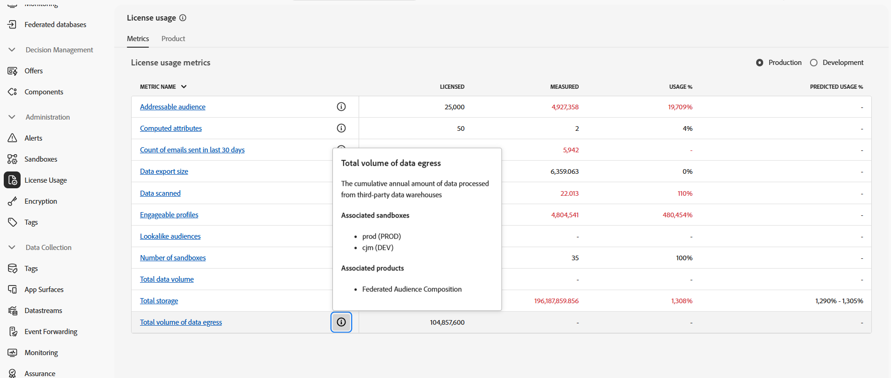

# Prerequisites and guardrails {#fac-access}

Federated Audience Composition requires Adobe Real-Time Customer Data Platform and/or Adobe Journey Optimizer **Prime** or **Ultimate** packages. To access this capability, you must have purchased the Federated Audience Composition add-on.

>[!AVAILABILITY]
>
>After your received the welcome email notification from Adobe, it might take a few more hours for the interface to be updated and features available to you.

## Supported systems {#supported-systems}

Federated Audience Composition supports the following cloud warehouses:

* Amazon Redshift
* Azure Synapse
* Databricks
* Google BigQuery
* Snowflake
* Vertica Analytics
* Microsoft Fabric

You can learn how to create a connection with these systems on the [connections overview](../connections/home.md).

## Sandboxes

When purchasing Federated Audience Composition, you are entitled to two sandboxes. For any additional sandbox provisioning requests, contact your Adobe representative.

To view the list of your active Federated Audience Composition sandboxes, follow the steps below:

1. From Federated Audience Composition, access the **[!UICONTROL License usage]** menu under **[!UICONTROL Administration]**.

1. Select the  icon from **[!UICONTROL Total volume of data egress]** to access your sandbox properties.

    

1. Information about your sandbox is shown in the Properties popover.

    

## Permissions {#permissions}

To access Federated Audience Composition, users must be added to the sandbox-specific product profile created upon purchase and assigned the **[!UICONTROL Manage Federated Data]** permission. [Learn more](/help/governance-privacy-security/access-control.md)

## IP allow-listing {#ip}

To securely enable Federated Audience Composition to access your databases, you must authorize the IP addresses of the Federated Audience Composition servers that will access them. These IP addresses are displayed when adding a federated database in the Adobe Experience Platform user interface. [Learn more](../connections/home.md)

Add these IP addresses to your allow list to grant access for Federated Audience Composition.

## Merge policies {#merge-policies}

If your sandbox uses a **dataset precedence** merge policy, please contact Adobe Customer Care to add the `Halos UPS` dataset to your merge policy.

For more information on merge policies, please read the [merge policies overview](https://experienceleague.adobe.com/en/docs/experience-platform/profile/merge-policies/overview).

## Guardrails and limitations {#fac-guardrails}

* Entitlements, product limitations and performance guardrails listed in the [Adobe Real-Time Customer Data Platform documentation](https://experienceleague.adobe.com/en/docs/experience-platform/profile/guardrails){target="_blank"} apply to Federated Audience Composition.

* Federated Audience Composition supports the export of large audiences, with file sizes greater than 1 GB. For optimal performance, the maximum recommended file size is up to 20 GB.
