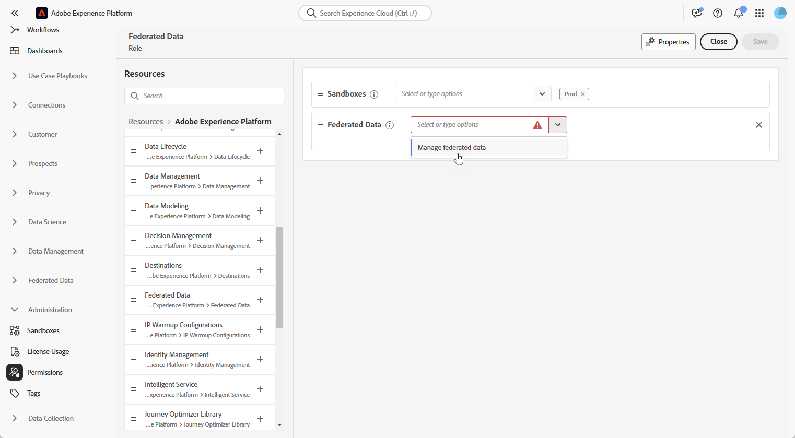

# Access Federated Audience Composition {#feature-access}

## Manage access to sandboxes {#access-sandboxes}

When you purchase the Federated Audience Composition add-on, a product profile is created for each active sandbox at that time. This product profile is created in the Admin Console under the **Adobe Experience Platform** product card and follows this naming convention: `ACP_FAC - <<SandboxName>> - admin.` To access the Federated Audience Composition for a specific sandbox, users must be added to the product profile created for that sandbox.

For example, if a new sandbox named "fac-test" is activated, a corresponding product profile "ACP_FAC - fac-test - admin" is created. In order to access Federated Audience Composition with this sandbox, users need to be added to this product profile.

## Manage access to Federated Audience Composition

>[!AVAILABILITY]
>
>Permissions are available as part of the February release.

To access **Federated Audience Composition**, you must first ensure that the **Manage Federated Data** permission is assigned to the appropriate roles. These roles must then be assigned to users who need acccess to **Federated Audience Composition**.

Note that only administrators have the ability to assign permissions.

1. Navigate to the **[!UICONTROL Permissions]** menu.

1. From the **[!UICONTROL Roles]** menu, select the **[!UICONTROL Role]** you wish to update.

    

1. Click **[!UICONTROL Edit]** to modify your role's permissions.

    

1. Add the **Federated Data** resource, then select **[!UICONTROL Manage Federated Data]** from the drop-down menu.

    

1. Once you've made the necessary changes, click **[!UICONTROL Save]**.

Any users already assigned to this role will have their permissions automatically updated and access to Federated Audience Composition.

To assign this role to new users:

1. Navigate to the **[!UICONTROL Users]** tab within your Role dashboard and click **[!UICONTROL Add Users]**.

    

1. Enter the user's name or email address, or select from the available list. Once done, click **[!UICONTROL Save]**.

The user will then receive an email with instructions to access your instance. If the user was not previously created, refer to the [this documentation](https://experienceleague.adobe.com/en/docs/experience-platform/access-control/abac/permissions-ui/users).

