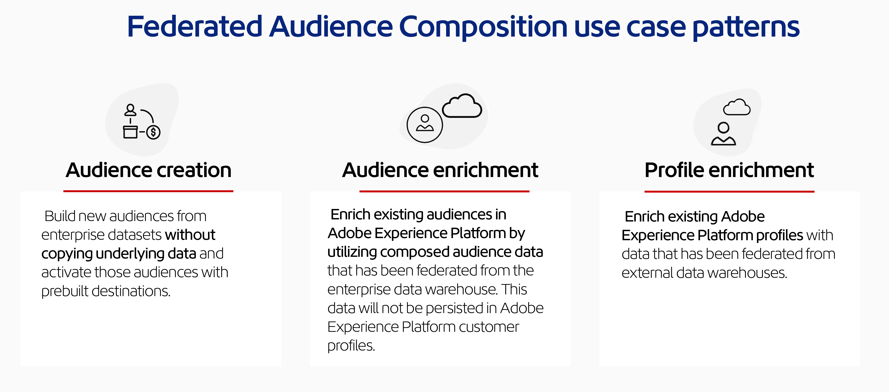

# Get Started with Federated Audience Composition {#gs-fac}

Federated Audience Composition is available for [Adobe Real-Time Customer Data Platform](https://experienceleague.adobe.com/en/docs/experience-platform/segmentation/home){target="_blank"} and [Adobe Journey Optimizer](https://experienceleague.adobe.com/en/docs/journey-optimizer/using/ajo-home){target="_blank"} environments. It allows you to build and enrich audiences from your third-party data warehouses and import the audiences into Adobe Experience Platform. Federated Audience Composition brings an easy and powerful solution to connect your enterprise data warehouse directly within Adobe Real-Time Customer Data Platform and/or Adobe Journey Optimizer, and perform queries on the tables of your data warehouse. 

Adobe Federated Audience Composition helps Adobe Experience Platform apps users to access their customer data which stored into their data warehouses and cloud storage platforms such as Amazon Redshift, Azure Synapse Analytics, and more. Customer data can live in multiple data warehouses and are now accessible instantly, without replication. Supported platforms are listed in [this page](../connections/federated-db.md#supported-db).

>[!INFO]
>
>Follow this [step-by-step guide](https://experienceleague.adobe.com/en/docs/platform-learn/tutorial-comprehensive-technical/datacollection/module13/fac) to learn how to create audiences using Federated Audience Composition.

## Capabilities {#rn-capabilities}

Federated Audience Composition extends the value of Real-Time CDP and Journey Optimizer with a comprehensive approach to audience curation and activation:

* Expand access to critical warehouse-based datasets to create high-value audiences: Utilize existing data warehouses as the main system of record, while leveraging best-in-class applications to power great customer experiences.

* Comprehensive support to power engagement use cases: Federated Audience Composition, paired with Real-Time CDP or Journey Optimizer supports brand-initiated, personalized experiences with federated audiences and delivers in-the-moment experiences triggered by real-time events, combined with person attributes to meet use case requirements across teams.

* Minimize data movement and duplication: Create audiences from datasets that live in an enterprise data warehouse without copying underlying data to manage actionable marketing profiles and audiences.

* Utilize a single system for experience-driven workflows: Curate ingested and federated audiences in Adobe Experience Platform and coordinate outbound experiences across all channels.

* The creation and enrichment of people-based audiences are supported for B2B CDP customer use cases.

## Use cases {#rn-uc}

Through a marketing-friendly UI, create segment rules that query your data warehouse for a list of users that qualify for a specific segment needed for marketing campaigns, access existing audiences in the warehouse for activation, or enrich Adobe Experience Platform audiences with additional datapoints that exist in the warehouse. 

In this version, two use cases are available: 

1. Audience Creation:  Build new audiences from enterprise datasets without copying underlying data and activate those audiences with prebuilt destinations.

1. Audience Enrichment: Enrich existing audiences in Adobe Experience Platform by utilizing composed audience data that has been federated from the enterprise data warehouse. This data will not be persisted in Adobe Experience Platform customer profiles.

{zoomable="yes"}{width="75%" align="center"}

## Key steps {#gs-steps}

Adobe Federated Audience Composition lets you create and update Adobe Experience Platform audiences directly from your database, without any ingestion process.

<!--{zoomable="yes"}{width="85%" align="center"}-->

Key steps:

1. **Data Integration**: Bring together data from various sources, and merge them into a unified dataset. Learn how to connect Adobe Experience Platform apps and your enterprise data warehouse, supported databases, and how to configure them are detailed in [this section](../connections/federated-db.md).

1. **Data Modeling**: Design and create data models and schemas that define the structure, relationships, and constraints of the data. Learn more about schemas in [this page](../customer/schemas.md). Learn how to create links for your datamodel in [this page](../data-management/gs-models.md).

1. **Data Transformation**: Apply data manipulation techniques to modify the format, structure, or values of data elements to make them compatible or suitable for specific analysis or applications.

1. **Data Usage**: Create, orchestrate and build audiences. Learn how to compose audiences in [this page](../compositions/gs-compositions.md). You can also update or reuse existing audiences through Adobe Experience Platform Audience portal and Destinations. Learn more in [this page](../connections/destinations.md)

>[!NOTE]
>
>After executing the composition, the resulting audience is saved in Adobe Experience Platform as an external audience, and available into Adobe Real-Time Customer Data Platorm and/or Adobe Journey Optimizer. It is made accessible in the **Audiences** menu. [Learn more](https://experienceleague.adobe.com/en/docs/experience-platform/segmentation/ui/audience-portal){target="_blank"} 

## Learn more {#learn}

<!-- Workflow + Workflow activities-->

Learn how to access Federated Audience Composition, guardrails and limitations in [this page](access-prerequisites.md).

See also frequently asked questions in [this page](faq.md).

>[!CONTEXTUALHELP]
>id="dc_workflow_settings_execution"
>title="Execution settings"
>abstract="In this section, you can configure settings related to the execution of the worklow, such the number of days the composition history is kept."

>[!CONTEXTUALHELP]
>id="dc_orchestration_query_enrichment_noneditable"
>title="Activity non editable"
>abstract="When a **Query** or an **Enrichment** activity is configured with additional data in the console, the enrichment data is taken into account and passed into the outbound transition, but it cannot be edited."

<!-- Create a link --> 

>[!CONTEXTUALHELP]
>id="dc_federated_database_create_link"
>title="Create a link"
>abstract="Define the link settings."

<!-- incremental query IDs -->

>[!CONTEXTUALHELP]
>id="dc_orchestration_incrementalquery"
>title="Incremental query"
>abstract="The **Incremental query** activity allows you to query the database using the Query modeler. Each time this activity is executed, the results from the previous executions are excluded. This allows you to target only new elements."

>[!CONTEXTUALHELP]
>id="dc_orchestration_incrementalquery_history"
>title="Incremental query history"
>abstract="Incremental query history"

>[!CONTEXTUALHELP]
>id="dc_orchestration_incrementalquery_processeddata"
>title="Incremental query Processed data"
>abstract="Incremental query Processed data"

>[!CONTEXTUALHELP]
>id="dc_orchestration_incrementalmode_standard"
>title="Incremental query mode"
>abstract="The incremental query allows you to execute the same query several times by excluding the results of previous executions for each new execution."

>[!CONTEXTUALHELP]
>id="dc_orchestration_incrementalmode_custom"
>title="Incremental query mode"
>abstract="The incremental query allows you to execute the same query several times by only taking into account the results where the date field is later than or equal to the last execution date of the incremental query activity."

>[!CONTEXTUALHELP]
>id="dc_orchestration_build_audience_dimension"
>title="Select the targeting dimension"
>abstract="The targeting dimension lets you define the population targeted by the operation: recipients, contract beneficiaries, operator, subscribers, etc. By default, for emails and SMS, the target is selected from the Recipients built-in table. For Push notifications, the default target dimension is Subscriber applications."

<!-- save profile IDs-->

>[!CONTEXTUALHELP]
>id="dc_orchestration_saveprofile"
>title="Save Profile"
>abstract="Save Profile"

>[!CONTEXTUALHELP]
>id="dc_orchestration_saveprofile_selectaepschema"
>title="Save Profile Select AEP Schema"
>abstract="Save Profile Select AEP Schema"

>[!CONTEXTUALHELP]
>id="dc_orchestration_saveprofile_aepschemalist"
>title="Save Profile AEP Schema List"
>abstract="Save Profile AEP Schema List"

>[!CONTEXTUALHELP]
>id="dc_orchestration_saveprofile_selectaepattribute"
>title="Save Profile AEP Schema Attribute"
>abstract="Save Profile AEP Schema Attribute"

>[!CONTEXTUALHELP]
>id="dc_orchestration_saveprofile_selectprimaryfield"
>title="Save Profile Select Primary identify field"
>abstract="Save Profile Select Primary identify field"
